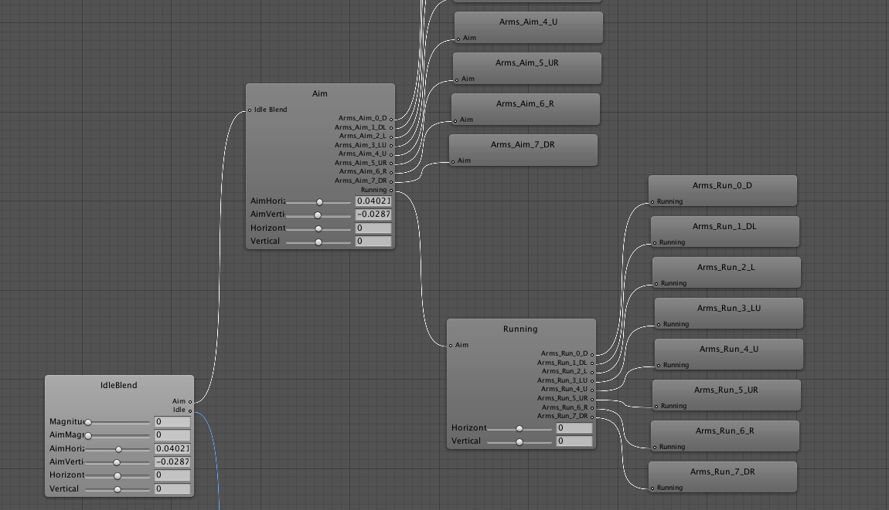
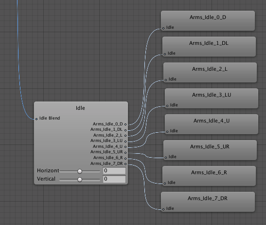

After watching [this amazing video tutorial on YouTube on making 2D games](https://www.youtube.com/watch?v=rycsXRO6rpI&list=PLM83Z6G5iM3mnAd3MVJeZh7b7ilHd73V5&index=1), this week's breakthrough is discovering the magic of blend trees. Before watching this video, I hadn't really used blend trees. However, I was somehow trying to give my character a bit more complexity than Couch Ferret's archer character in the video using raw, animation state machines to limited success.

For one, I wanted my game's character avatar to be able to transition between _idle_, _aiming_ and _firing_ animations on only the upper body sprite and preserve independence from the lower body (after all, the player might running AND in the above states at the same time). Similar to Couch Ferret's video, in that regard. Only I had started with a very rudimentary state machine in my game prototype that looked like this:

Not terrible, per se, but starting to get very complicated. Too many in/out transitions to manage, etc.

However, after discovering the magic of blend trees, I refactor the state machine into this, blend-tree based state machine:

Under the "Inactive" state, I hid the following blend tree:

This proved to not work all that well, so I had to break it up into actually a blend tree with another sub-blend-tree.

After putting together a little tilemap...

I ended up with the following result:

I'm pretty satisfied with the end result since it seems to transition between all the states very smoothly and with easy to manage code.

That's it for now, perhaps next week I'll start being able to use this guy:

