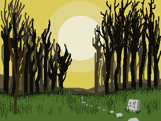
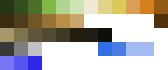
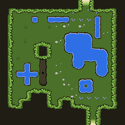
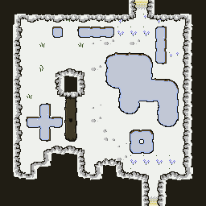
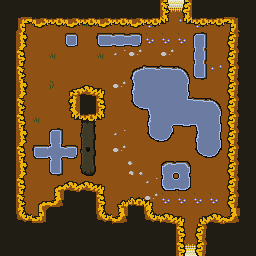
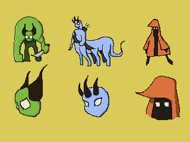

Last week, I spent a lot of time [writing code for making procedurally generated levels.](/posts/constant-i-o-procedurally-generated-levels). That was fun. But it left me neglecting the overall world-building and design elements for this untitled game in progress. So this week I tried to spend more time becoming a better designer and world-builder.

### Colors and PixelArt

I started the week with buying [a new book on Pixel Art, _Pixel Art For Game Developers_ by Daniel Silber](https://www.amazon.com/Pixel-Game-Developers-Daniel-Silber/dp/1482252309). At first, I found the price tag to be a little bit hefty for a Kindle editions, but I went ahead and took the plunge. Inside, I found it to be a pretty well illustrated and informative and worth the price tag given the sheer volume of colorful illustrations and diagrams (probably more true in the print editions, than kindle tho.) . Throughout the week I read the first 75% of the book on my commute to work and realized I had been making a ton of rookie mistakes with my pixel art.

The first of my pixel art rookie mistakes was my color palette issues. Up until now, I had been using a color palette from [a made up console system called the Famicube](https://androidarts.com/palette/Famicube.htm#) that I got from [LOSPEC](https://lospec.com/palette-list). This made some sense given a kind of meta-retro aesthetic I had been trying to go for, but this might have caused a dearth of color variation in my designs up to that point given my n00b status at pixelart. So using Silber's approach to using gradients and color ramps to design entire palettes, I worked on designing my own color palette based on incremental color ramps and gradients. That is, I manually tuned the Hue, Saturation and Luminosity/Lightness values on certain base colors until I generated a few incremental color "steps" in a gradient.

There is some x/y sorting happening there, but for the most part rows (x) are changes in luminosity steps while vertical (y) are saturation/hue changes. This isn't super consistent, though, and the whitespace denotes non-contiguous color gaps.

### World Building

Using this palette I tried to create some concept art based on that. Although I'd say there are a bunch of influences I'd been drawing from for this game, I knew that some sort of forest biome should be a part of it. So I started by compiling a few reference images of "haunted forests" such as this one:

And this one:

(Both of which seem to be of Hoia Baciu, a "haunted" forest in Transylvania, Romania)

And I put together a small mood board of these images. From that, I began drawing on PyxelEdit and seeing if I could derive some concept imagery for my game that followed two rules:

1. Utilitzed a consistent palette based on gradients/ramps of color changes.
2. Provided some mood/color to the game project I'm working on.

I came up with:

### Updated Tilesets

From that concept art I decided to start over on my forest tilemap (scrapping the one I had used on my previous PGC level demo). This new tilemap would have a consistent palette, but a palette more in line with the "mood" I was going for rather than the Famicube palette I had been using before. In this way, perhaps, ditching some of the meta/retro in favor of actually trying to build a style for the game.

Though I didn't stick entirely to the original palette from the concept sketch, I did iterate on it and add a few colors for objects in the forest such as water features and dirt (as well as the absence of sky, given the top down view here):

Using this palette I created the following "mock level" (which is basically not a functional level, but more of a showcase of the tiles):

This seemed to work much better than my previous attempts, having a lot more lighting detail and edge definition. However, taking one more idea from Silber's book, I decide to try a brief "palette swap". This means that I would take 3 specific swatches and replace them with 3 different ones in order to change the tileset in some meaningful way.

By swapping three of the greens in the palette with white and grays and the water color with a more pastel blue, I was able to change the tilemap to a "winter" setting. But seeing how decent this turned out, I decide to do one more palette swap and see if I could create an "Autumn" mood:

### Creatures and Monsters

So after making these settings, I decided it was time to spend more time actually thinking about monster design (instead of y'know, being lazy and using a generic zombie for every enemy like I had been doing.) Based on [some sketches](/posts/sketchbook-monsters) I did earlier in the week, I came up with the following creatures that could presumably roam these forests (once again using the same color palette as before):

Though certainly rough around the edges (literally and figuratively) these can help guide my development of usable sprites, though certainly breaking out of the 32x32 box I've been using for my zombie and player avatar thus far.

### Now What?

Although I'm pleased with the results, I'd like to start creating usable game assets from these concepts. This means "down-sizing" them and coming up with behaviors and attacks for these monsters as well as NPC characters, etc. Another thing I would like to do is "go edgeless". Black edges around all the characters and tiles is a bit of a crutch. This actually clashes with the sprites I had made before and part of the "look" I'd like to go for is the edgeless, less cartoony style if possible. I think I can de-edge all of these concepts, however, and make something more consistent with the style I'm aiming for.
