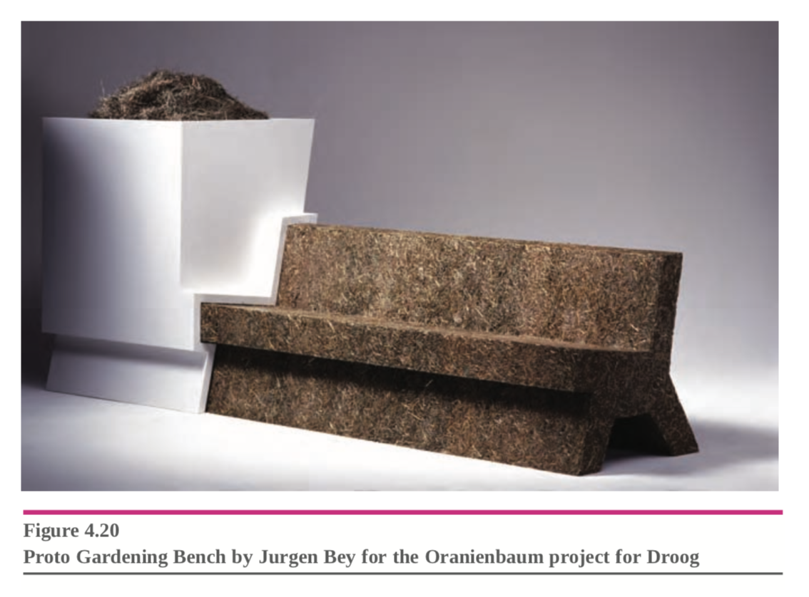

This week's reading from _Design Activism: Beautiful Strangeness for a Sustainable World_ was full of not just ideas, but some really neat examples of designs/installations/artifacts that I had never seen before but really drove the idea home. The way the chapter illustrated and defined each method of design activism worked quite well.

The subsection on communication using cleverly designed ads very aptly showed how design can function as activism in today's world. Through these imaginative communications, designers create as means by which to go beyond the 'white noise' (perhaps a subtle reference to the Don DeLillo novel of that same title in some ways about the same topic perhaps?). In their words:

> Finding new ways to communicate requires imaginative use of design to penetrate beyond the ‘white noise’ (many random signals of equal intensity) of contemporary life.

The second method (or perhaps series of methods?) that stood out was ethical manufacturing or at least alternative manufacturing methods as a means for design activism. But why should we manufacture ethically? And why is this particular method so important? Well because we can't rely on distributed manufacturing forever:

> The global economy enables transnational corporations to manufacture their brands anywhere that competitive labour prices and raw or manufactured materials can be readily brought together. This ‘distributed’ manufacturing relies entirely on fossil fuels to move raw materials, components and finished products around the globe. Peak oil will challenge this model of manufacturing as the proportional cost of oil rises in each part of the supply and distribution chains.

From this family of ethical manufacturing, the project that most stood out to me in the section emerged:

This idea of "ephemeral seating" really spoke to me because:

1. it's an example of design activism
2. it's sustainable
3. as primitive people long ago, there was only ephemeral seating

Building on _3._, the fact that our addiction to "distributed manufacturing" has gotten so intense that even our park benches require global shipping and plastic and non-local-parts is kind of absurd. Why shouldn't we just sit on part benches made of naturally degrading waste biproducts?
