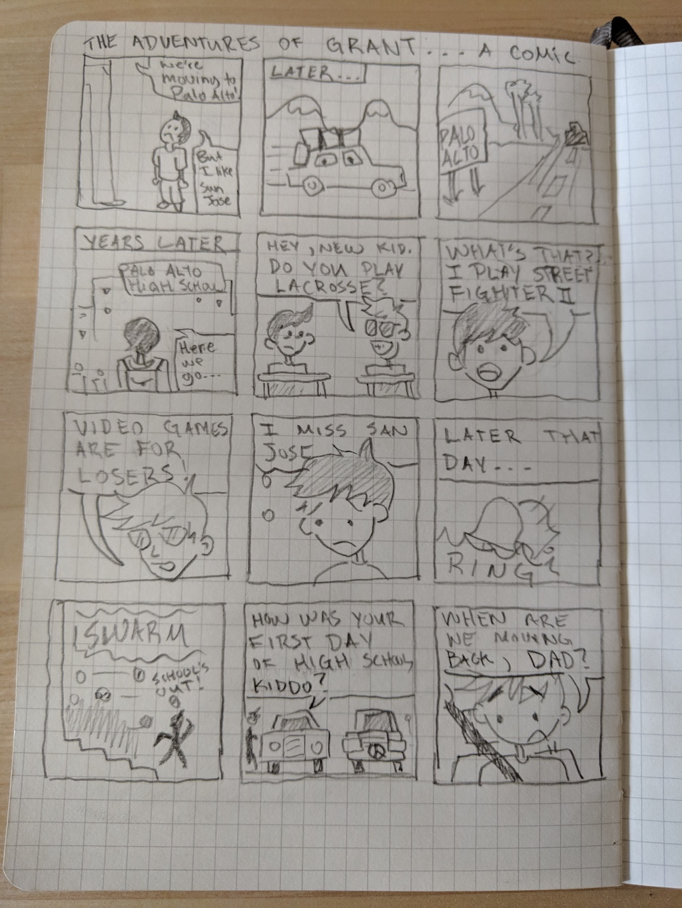

As part of my collaboration with Grant Ng, we spent a bit of time interviewing each other in class. From that interview, one of Grant's stories about his life stood out to me. It was his story of moving from the East Side of San Jose to Palo Alto and having a difficult time adjusting to life in the new city. Based on that story, I tried my best to condense the situation into a short, one-page comic about the ordeal that creates a small portrait of Grant at an earlier stage in his life. This is the result:

