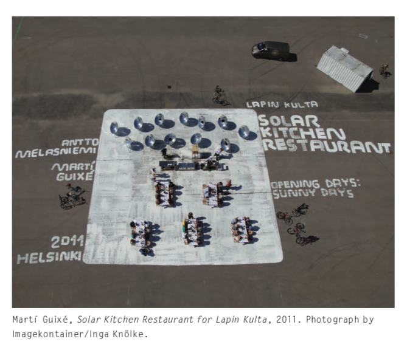
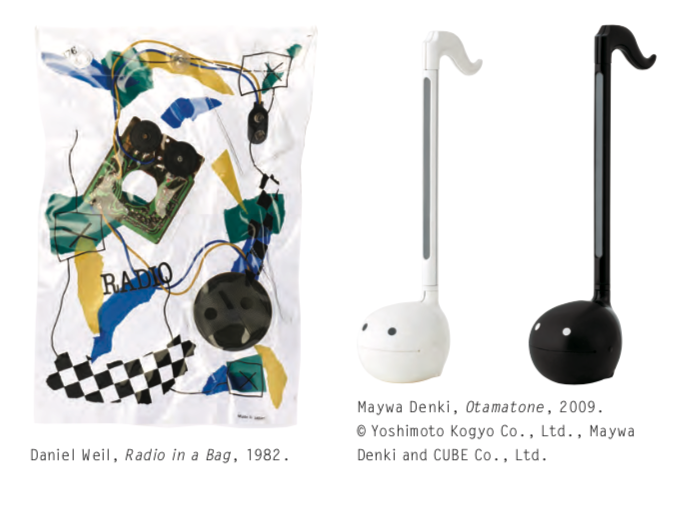

Before reading the first two chapters of _Speculative Everything_ by Anthony Dunne and Fiona Raby, I hadn't really given a name to the concept to which they are describing. I felt that some designs could be forward-looking, and others not so much. But I had never really heard the terms _speculative design_ or:

> to use design as a means of speculating how things could be.

As Dunne & Raby point out, this form of design is necessary on many levels. They help make the case for speculative design by saying:

> We believe that by speculating more, at all levels of society, and exploring alternative scenarios, reality will become more malleable and, although the future cannot be predicted, we can help set in place today factors that will increase the probability of more desirable futures happening. And equally, factors that may lead to undesirable futures can be spotted early on and addressed or at least limited.

This gives an urgency and function to speculative designs, defending it against some of the criticisms this form of design often seems to get for being impractical.

Dunne & Raby also do a great job of expressing how the skepticism of such design came to be. Apparently, this started in the 1980s (kinda):

> Design became fully integrated into the neoliberal model of capitalism that emerged during the 1980s, and all other possibilities for design were soon viewed as economically unviable and therefore irrelevant.

The 1980s also preceded a time of great societal change we experienced as a result of how technology changed communication starting in the 1990s. This change, as they describe it was that

> society has become more atomized. As Zygmunt Bauman writes in _Liquid Modernity_, we have become a society of individuals.

This change has had an impact on how democratic governments view its citizens, which in turn has ripple effects on art (perhaps a mirror of culture in and of itself):

> There has been a gradual shift in the United Kingdom from government that looks after the most vulnerable in society to a small government that places more responsibility on individuals to manage their own lives. ... the advent of the Internet has allowed people to connect with similar-minded people all over the world. As we channel energy into making new friends around the world we no longer need to care about our immediate neighbors.

This shift in attitudes takes its toll on our dreams, which make a good analog of the raw material of art. This struck me as exceedingly poignant, since it articulates thought I've had myself about how our imaginations have been affected by the recent changes to our society. This in turn has left us often failing to easily imagine alterative futures the way a generation or two ago did. The authors aptly described our generation with:

> a younger generation doesn’t dream, it hopes; it hopes that we will survive, that there will be water for all, that we will be able to feed everyone, that we will not destroy ourselves.

But all hope is not lost. In the second chapter of the book, their examples of contemporary art operating in this speculative space brought a silver lining to the present. Ones that stood out to me was Martí guixé’s projects, such like this one:

The authors, however, acknowledge that operating in this particular realm in today's art world can be difficult for both a producer and consumer of speculative designs. As they put it:

> Although it is possible to buy a “conceptual” skirt from Comme des garçons or A-PoC, it is not possible to buy a conceptual phone, at least not since the failed but brave efforts of Enorme in the 1980s or Daniel Weil’s batch-produced highly conceptual radios also from the 1980s.

They go on further to say:

> We recognize it is very difficult to finance this kind of design activity and there are limited opportunities but it is needed. It feeds the profession’s imagination and it opens up new possibilities, not only for technology, materials, and manufacturing but also for narrative, meaning, and the rethinking of everyday life.

This makes a fairly strong case for speculative design's importance and relevance now. It also dismisses its critics' concerns about its functionlessness. Ultimately, Dunne & Raby's idea of letting universities and art schools become forums for this type of art is a good one. In these environments, perhaps the constraints of late capitalist culture can be side-stepped a bit.
