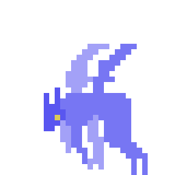
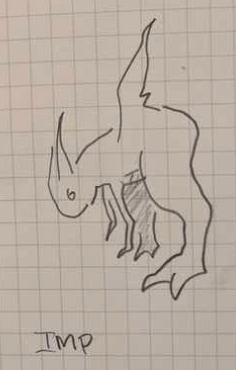
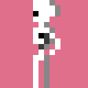
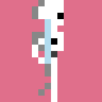
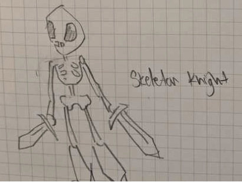

This week, I started to animate a few of the ideas from my [sketches of monsters](/posts/sketchbook-more-monsters) from last week.

## Imp

The first of which is this purple, imp-like creature:

Based on the following concept sketch:

For now, I'm sticking to the 16x16 pixel sprites on most creatures, but this Imp will be larger than others and thus 32x32. Think of him as a 2x monster.

## Skeleton

The second is a skeleton warrior is a 1x-size, humanoid enemy so 16x16 again:

This is based on the following concept:

Guess he needs a second sword.
