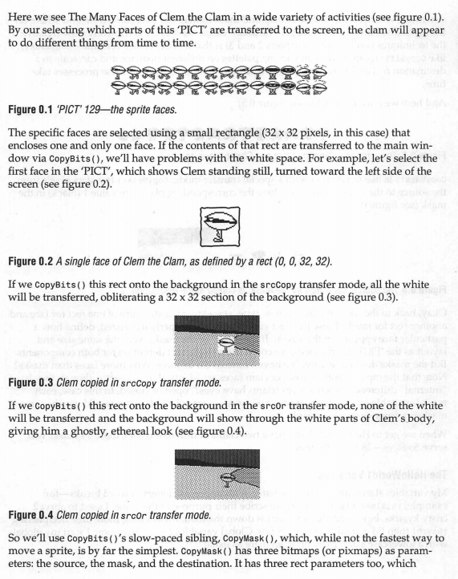
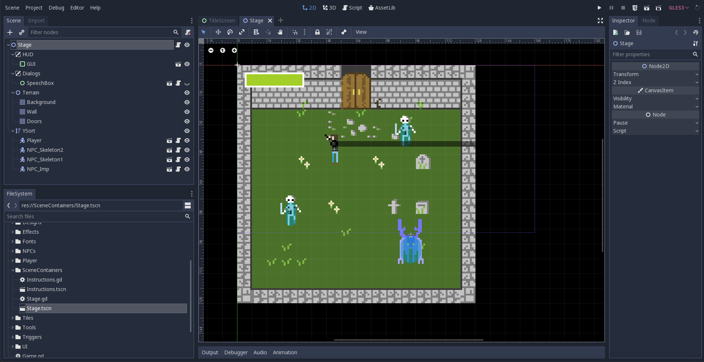
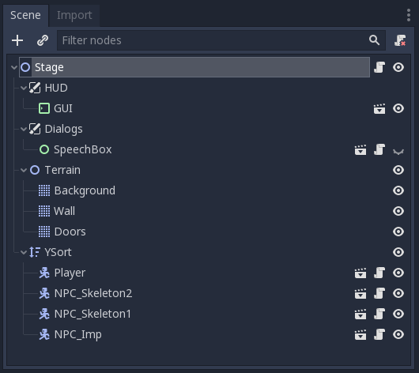
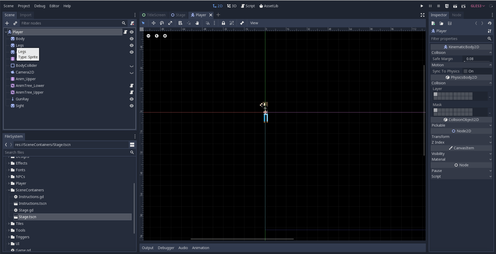
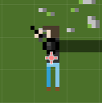
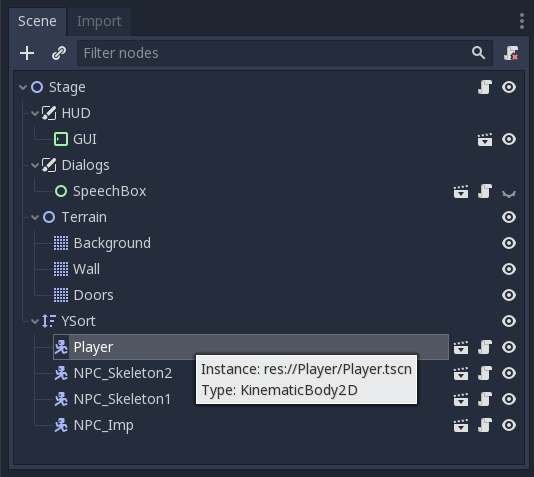
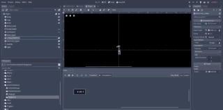
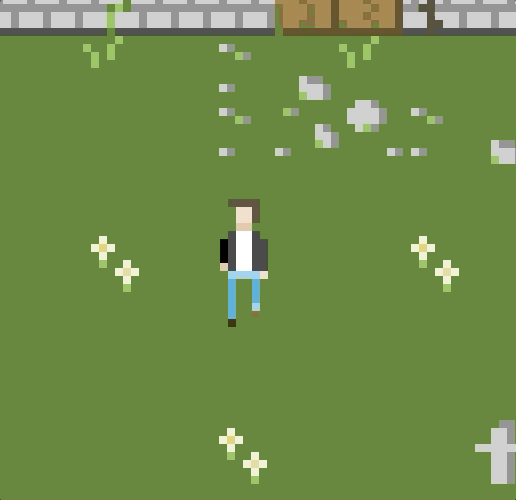
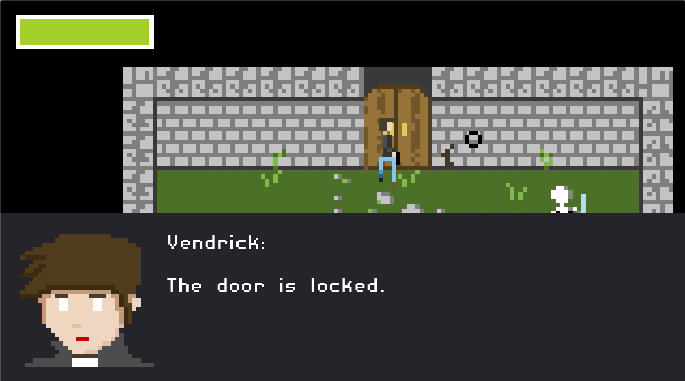

## Making Video Games

When I was a kid of about 12, I vaguely wanted to "make video games". This lead me to ask my mom to buy me books on the subject of how to "make video games" and that lead her to buying me [_Tricks Of The Mac Game Programming Gurus_](https://vintageapple.org/macprogramming/pdf/Tricks_Of_The_Mac_Game_Programming__Gurus_1995.pdf) (or _TOTMGPG_ )
in either 1996 or 1997 at a Borders in Orlando, FL.

_Cover Here Courtesy of VintageApple.org or [Amazon](https://www.amazon.com/Tricks-Mac-Game-Programming-Gurus/dp/1568301839)_

This book went over a lot of stuff I really didn't understand as a 12-year-old, like C programming and sprite sheets and defining functions. It was like a foreign language that went totally over my head. However, it did come with a really really cool CD-ROM disc (remember those?) full of indie-game demos along with their source code. This showed me what games really were like "under the hood", so to speak. More importantly (in the long run at least), its first chapter about making a little Hello World game about a talking clam really stuck with me and I remember it vaguely to this day.

I didn't know it then, but this would basically kickstart my life-long fascination with the magic of programming in general, even if it failed to teach me how to make games. I now professionally write code for a living and have a "career" (whatever that is). Unfortunately, for a number of reasons I hadn't actually carried out the "make video games" agenda I set out for myself when I was 12 in any meaningful way. Consequently, when the [Ideation & Prototyping class Constant I/O project](/process) started and I challenged myself to "make video games" for the duration of the class as my Constant I/O project. Even though its 2019, I actually took a very 1995-approach to making games.

## Sprite Sheets

[My very first constant I/O post](/posts/process-organizing-sprite-sheets) started out the way _TOTMGPG_ taught me game development started: by making sprite sheets and figuring out a good "system" for organizing them.

Over the weeks, I started to refine this process and standardize it. The 8x16 grid of 32x32 pixel tiles was not practical. I ended up in a place a bit more convenient for programming 8x8 grids of 16x16 pixel tiles (and sometimes 32x32). I then tried to optimize my workflow for using PyxelEdit more efficiently.

_My Initial Pyxel Edit Workflow_

[I then briefly switched to Aseprite](/posts/constant-io-aseprite-animations).

_My Aseprite Workflow_

Ultimately, though, I ended up coming back to PyxelEdit in the end since it felt the most compatible with my workflow. By the later stages of the sprite sheet process, I had learned get even more elaborate in organizing the pieces and making animations smoother:

_Final Player Avatar Sprite_

## Tilemaps

In addition to the character sprites, I focused making tilemaps using PyxelEdit around week 3. That process looked more-or-less like this:

### 1. Make A Tilemap In The Grid Editor

### 2. Use Layers to Manage Groups of Object Types

### 3. Export the Tileset as PNG

### 4. Export the Tilemap as JSON

Towards the end of Week 3, I combined the work with sprites and tilemaps into a small initial build that looked like this:

## Becoming a Better Pixel Artist

Throughout all of this I began to realize that my pixel-art chops were a bit weak. Although I'm capabable of making acceptable figure drawings and sketches of cartoon-y, vaguely anime-inspired stuff, I am extremely untrained. I've had a very limited understanding of color theory and composition up until this project. However, I took this as an opportunity to get better.

First I found a lot of really great videos on YouTube on the subject. Here are a few of my favorites from two stand-out talents [`HeartBeast`](https://www.youtube.com/user/uheartbeast) and [`MortMort`](https://www.youtube.com/user/atMNRArt)

<iframe width="560" height="315" src="https://www.youtube.com/embed/fCpalUPlhMs" frameborder="0" allow="accelerometer; autoplay; encrypted-media; gyroscope; picture-in-picture" allowfullscreen></iframe>

<iframe width="560" height="315" src="https://www.youtube.com/embed/QhgSM_tnPM4" frameborder="0" allow="accelerometer; autoplay; encrypted-media; gyroscope; picture-in-picture" allowfullscreen></iframe>

These videos did a great job of introducing me to the basic concepts, but I think what finally gave me an over-arching theory of the subjects was probably reading [_Pixel Art for Game Developers_ by Daniel Silber](https://www.amazon.com/Pixel-Game-Developers-Daniel-Silber/dp/1482252309).

## Choosing A Game Engine

Unlike the 1995-era game devs of _TOTMGPG_ using the C language for their games, in 2019 I had the luxury of fancy, fancy tools that are super easy on the developer. The first of which is Unity, which I had downloaded and played around with a long time ago. Unity helped me get off the ground very quickly.

### Unity

#### JSON Tilemap Importing

For example, I was easily able to make [my own JSON tilemap importer in C#](https://gist.github.com/omardelarosa/859a05f8881fe089f7e389b399f690bb):

<iframe width="560" height="315" src="https://www.youtube.com/embed/nooMScdCLU4" frameborder="0" allow="accelerometer; autoplay; encrypted-media; gyroscope; picture-in-picture" allowfullscreen></iframe>

#### Blend Trees

Unity's animation blend trees also helped me build really smooth sprite animation state machines:

These blend trees were crucial in setting up the twin-stick shooter AIMing animation mechanics:

However, when it came to animation and its cumbersome, manual workflow in Unity, I started to crave something different.

### Godot Engine

Despite Unity's highly programmable interface, it forced me to spend way too much time dragging and dropping inside a UI and not enough time writing code. And when I did write code, it was C#, which isn't a bad language, but feels clunky and not super modern (especially when using a Mac or \*nix OS). C# is almost as far from the Unix-philosophy as one can get. This lead me to explore other engines, the most interesting of which was [Godot](https://godotengine.org).

Godot has many great features that Unity kinda lacks:

-   [A Command Line Interface](https://docs.godotengine.org/en/3.1/getting_started/editor/command_line_tutorial.html)
-   [A Straight Forward Unit Test Framework](https://github.com/bitwes/Gut)
-   Clean file trees easily compatible with Git Version Control
-   A less classical, OOP style and quasi-functional scripting language.
-   Everything is a tree

#### Restarting Game in Godot Engine

About 3 weeks ago (Around week 11), I decide to challenge myself to "restart" the game project in Godot engine and see if I could do it, kind of like when I switched to Aseprite from PyxelEdit. Although I ended up switching back to PyxelEdit from Aseprite, the last few weeks have proven so much more productive in Godot that I am no longer planning on continuing this project in Unity.

#### Less Pixels

In Godot, I was very quickly able to rebuild a mechanically similar version of my original game demo:

Although there were a few notable differences from before, there weren't many.

First of all, I switched pixel formats. In the Unity game demo:

-   Sprite Size: 32x32
-   Tile Size: 16x16
-   Target Viewport Resolution: 320x240 (closer to NES)

For the Godot demo, I cut a lot of that in half:

-   Sprite Size: 16x16
-   Tile Size: 8x8
-   Target Viewport Resolution: 160x90 (closer to GameBoy)

These decisions were less about Godot, than they were about kind of a lofi, pixel-art aesthetic I prefered (not unlike the games I remember from the CD-ROM included with [_Tricks Of The Mac Game Programming Gurus_](https://vintageapple.org/macprogramming/pdf/Tricks_Of_The_Mac_Game_Programming__Gurus_1995.pdf) ((Amazon Link)[https://www.amazon.com/Tricks-Mac-Game-Programming-Gurus/dp/1568301839])).

Re-doing all the sprites also game me an opportunity to focus the aesthetic on the "quasi-horror + pixelart" feel I wanted to get to eventually, opting for a new player avatar sprite and some more monster-y enemies.

#### Everything Is Tree-Shaped

Another major benefit of Godot, is that everything is tree shaped:

Each element of the object hierarchy, while still a class and "object" in the code sense, is also a highly-composable Tree "Node". Unlike the Unity, object hierarchy that's full of inheritence and components and random panels of public/private variables that are difficult to re-arrange without turning into "Prefabs", Godot just has Nodes and Trees. A very scalable, recursive data structure that allows me to focus on pieces of the game in isolation easily but loop them back into the fold quickly.

For example, `Player` is a node inside a larger tree called `Stage` that I can independently work on as its own root node in isolation:

When I'm done, I can bring the player back into the `Stage` tree:

#### Blend Trees

Godot also offers many of the same features as Unity such as blend trees:

#### Particle Effects

Godot also offers a really robust API for 2D particle effects that allowed some pixel-art looking effects to be added that leveraged the rendering engine rather than being entirely hand-drawn. You can see here how I added particle effects for blood splatter and bullet ricochet:

#### Animation API

Godot's animation API is much more flexible than Unity's and allows me to mix-and-match blend trees with texture swaps to better match my 8x8 pixel sprite sheet layering strategy.

#### GUIs

Godot also allowed me to setup a really straight forward GUI. It includes a HUD and dialogue window:

## Where To Next?

Although I don't feel like I have a fully playable demo, the Constant I/O project has yieled a functional prototype of a game (and a ton of reusable framework-elements for future 2D-ish games). I hope to take this a few steps further and begin developing more content for the game and add story elements, characters, items, etc. My next goal would be to put something together that's actually fun and engaging as a stand-alone demo from these pieces and maybe put something on [my itch.io page](https://nabisco.itch.io/) or participate in a game jam.

Either way, I have only just started to "make video games" in any kind of meaningful way.

<iframe width="560" height="315" src="https://www.youtube.com/embed/K3swo1V0_lQ" frameborder="0" allow="accelerometer; autoplay; encrypted-media; gyroscope; picture-in-picture" allowfullscreen></iframe>
