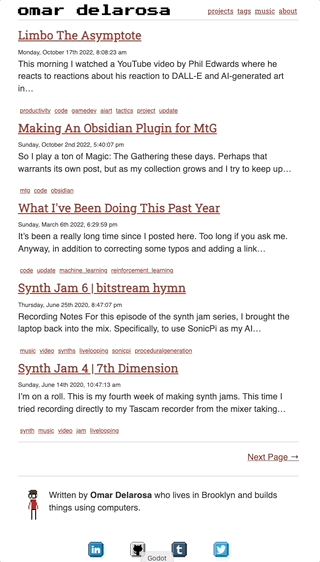
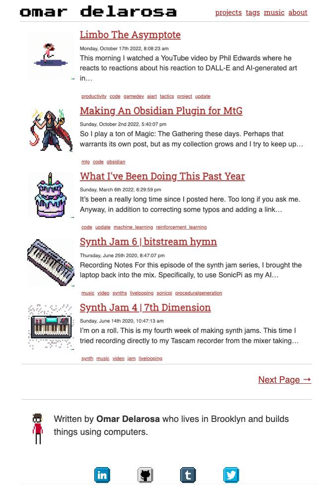

So earlier today, I added pagination to these posts:



I also restructured my posts URLs a bit going from `/content/blog/slug-goes-here ` to `/content/blog/YYYY/MM/DD/slug-goes-here`.  Had to setup some redirects, etc, but that was simple enough.

This required a bit of work on the `migrate.js` script in here, but it got me thinking about making more programatic changes to all my posts at once.  One crazy idea I had is:

> What if all my posts had little thumbnail images beside them?



Then I thought:

> Damn.  Where am I gonna get these images?  I don't have an illustrator or a design team.

Then I had a little mini eureka moment:


> What if I generated using [DALL-E](https://labs.openai.com/) or [Stable Diffusion](https://huggingface.co/spaces/stabilityai/stable-diffusion)?

## How To Generate Images Manually

So you can easily generate little images using DALL-E and save them with each post:

[](https://labs.openai.com/e/R81D9SxOnv9GPjRzMHhv9wgd)
[](https://labs.openai.com/e/ZGVY68mVdGN7uXQpErT9RrIl)
However, that process is pretty manual.  I'd like it to be something like a pipeline that I can run during my Gatsby site build (or before it).

## How to Generate a list of Prompts

So I figured no matter what route, I needed to generate a list of all my posts, their source filepaths and their tags, etc.  These could be used to make prompts Using my GatsbyJS GQL Schema, the query looks like this:

```gql
query PostsTagsEtc {
   allMarkdownRemark {
    edges {
      node {
        frontmatter {
          tags
          title
          ogDescription
          slug
          date
        }
        fileAbsolutePath
      }
    }
  }
}
```

This results in some nice JSON I can use to make my prompts:

```json
{
  "data": {
    "allMarkdownRemark": {
      "edges": [
        {
          "node": {
            "frontmatter": {
              "tags": [
                "code",
                "update",
                "machine_learning",
                "reinforcement_learning"
              ],
              "title": "What I've Been Doing This Past Year",
              "ogDescription": null,
              "slug": "its-been-too-long",
              "date": 1646609399762
            },
            "fileAbsolutePath": "/path/to/code/website/content/blog/2022/03/06/what-ive-been-doing-this-past-year/index.md"
          }
        },
        {
          "node": {
            "frontmatter": {
              "tags": [
                "music",
                "video",
                "synths",
                "livelooping",
                "sonicpi",
                "proceduralgeneration"
              ],
              "title": "Synth Jam 6 | bitstream hymn",
              "ogDescription": null,
              "slug": "synth-jam-6-or-bitstream-hymn",
              "date": 1593132427404
            },
            "fileAbsolutePath": "/path/to/code/website/content/blog/2020/06/25/synth-jam-6-or-bitstream-hymn/index.md"
          }
          // etc...
        }, ]}}}
```

From here, I can then make prompts from the title, tags and/or slugs by saving the above result as a json file and then using a simple python script to format it for my pipeline:

```python
import json
import os

cwd = os.getcwd()

source_root = "/path/to/your/repo"
input_file_name = cwd + '/data/posts.json'
output_file_name = cwd + '/data/prompts.json'
outdir_prefix = "thumbnails"

# Read the file data
with open(input_file_name, 'r') as f:

    data = json.load(f)

    output = []

    for edge in data["data"]["allMarkdownRemark"]["edges"]:
        prompt = None
        slug = edge["node"]["frontmatter"]["slug"]
        
        if slug is not None:
            slug_as_words = slug.split("-")
            prompt = " ".join(slug_as_words)
        else:
            title = edge["node"]["frontmatter"]["title"]
            if title is not None:
                prompt = title
            else:
                print("no slug or title found for: ", edge)
        if prompt is not None:
            output.append({
                # This is the actual prompt
                'prompt': prompt,
                'outdir': sourcefilepath.replace("index.md", outdir_prefix)
            })

# Write the output file
with open(output_file_name, 'w') as json_file:
    json.dump(output, json_file)
    print("wrote prompts to: ", output_file_name)
```

Obviously you can experiment with better systems for generating prompts, but I just went with a simple transformation on my post titles and slugs.

Afterwards, you can then save your resulting `prompts.json` file and keep it around

## Stable Diffusion Model Pipeline

For the sake of simplicity, I went with a Google Colab Notebook I found as a base and then updated it with some additional code to process my `prompts.json` file and generate images for me that I could download as simple files later.

The first set of results didn't look great to me, but at least they worked as a proof of concept:

