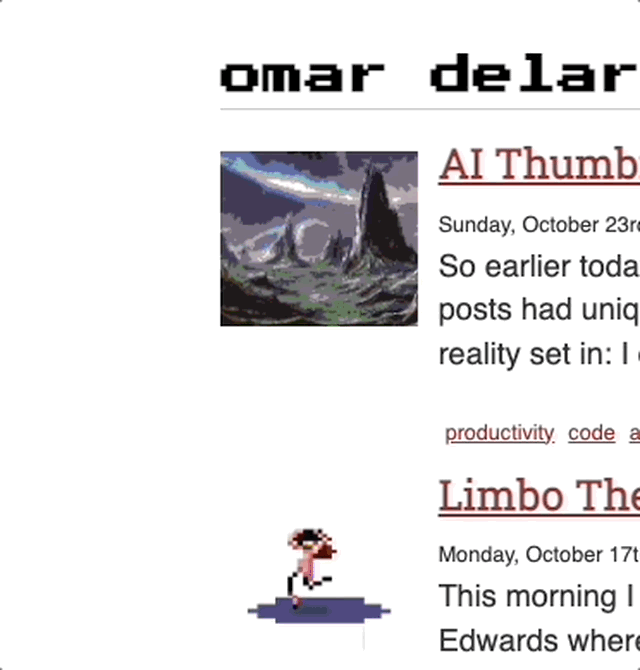
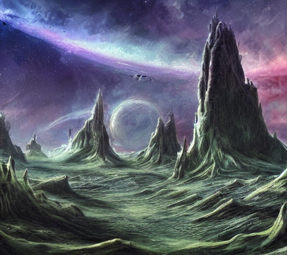
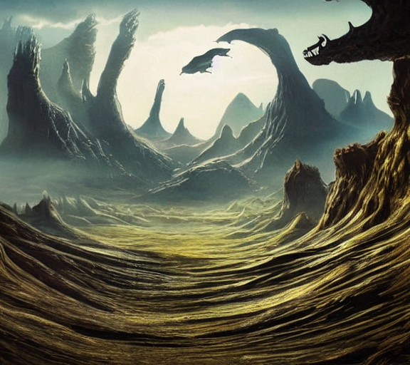
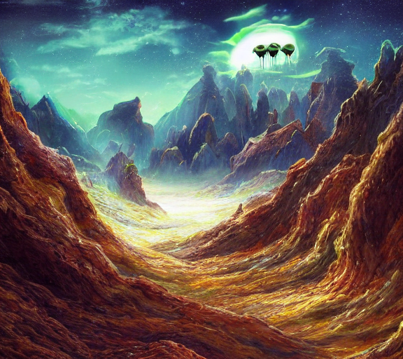
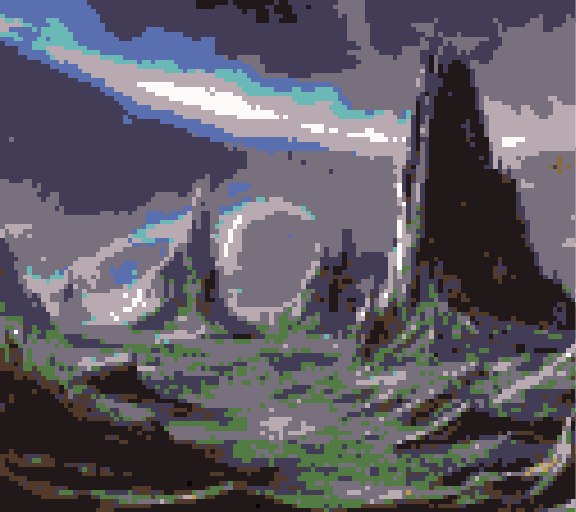

So earlier today, I had a thought:

> What if all of these posts had unique thumbnail images beside them?



Then reality set in: 

> I don't have an illustrator or a design team.  I'm just one guy with a markdown blog.

Then I had a little mini eureka moment:


> What if I generated all my thumbnails using [DALL-E](https://labs.openai.com/) and/or [Stable Diffusion](https://huggingface.co/spaces/stabilityai/stable-diffusion)?

And so I did!

## How To Generate Images Manually using DALL-E

So one can easily generate little images using [OpenAI's DALL-E API](https://labs.openai.com/) and save them with each post:

[](https://labs.openai.com/e/R81D9SxOnv9GPjRzMHhv9wgd)
[](https://labs.openai.com/e/ZGVY68mVdGN7uXQpErT9RrIl)
However, that process is pretty manual. The ideal process would be something like a pipeline or some way to do it programmaticall during the Gatsby `build` task (or before it).

## Generating A List of Text Prompts

Regardless of which route, a list of all the blog posts needs to be generated with their source filepaths and their tags, etc.  These could be used to make prompts from.  So using GatsbyJS GQL Schema a query like this can be created to extract text content from all of your posts.

```gql
query PostsTagsEtc {
   allMarkdownRemark {
    edges {
      node {
        frontmatter {
          tags
          title
          ogDescription
          slug
          date
        }
        fileAbsolutePath
      }
    }
  }
}
```

This returns some nice, structured JSON to fuel image-gen model prompts:

```json
{
  "data": {
    "allMarkdownRemark": {
      "edges": [
        {
          "node": {
            "frontmatter": {
              "tags": [
                "code",
                "update",
                "machine_learning",
                "reinforcement_learning"
              ],
              "title": "What I've Been Doing This Past Year",
              "ogDescription": null,
              "slug": "its-been-too-long",
              "date": 1646609399762
            },
            "fileAbsolutePath": "/path/to/code/website/content/blog/2022/03/06/what-ive-been-doing-this-past-year/index.md"
          }
        },
        {
          "node": {
            "frontmatter": {
              "tags": [
                "music",
                "video",
                "synths",
                "livelooping",
                "sonicpi",
                "proceduralgeneration"
              ],
              "title": "Synth Jam 6 | bitstream hymn",
              "ogDescription": null,
              "slug": "synth-jam-6-or-bitstream-hymn",
              "date": 1593132427404
            },
            "fileAbsolutePath": "/path/to/code/website/content/blog/2020/06/25/synth-jam-6-or-bitstream-hymn/index.md"
          }
          // etc...
        }, ]}}}
```

From here, the above results are saved as a json file and then using a simple python script to format will transform it into an easier to work with list I've called `posts.json` here:

```python
import json
import os

cwd = os.getcwd()

source_root = "/path/to/your/repo"
input_file_name = cwd + '/data/posts.json'
output_file_name = cwd + '/data/prompts.json'
outdir_prefix = "thumbnails"

# Read the file data
with open(input_file_name, 'r') as f:

    data = json.load(f)

    output = []

    for edge in data["data"]["allMarkdownRemark"]["edges"]:
        prompt = None
        slug = edge["node"]["frontmatter"]["slug"]
		# This uses the slug as a prompt, but it can be any field
        slug_as_words = slug.split("-")
        prompt = " ".join(slug_as_words)
        outdir = sourcefilepath.replace("index.md", outdir_prefix)
        if prompt is not None:
            output.append({
                # This is the actual prompt
                'prompt': prompt,
                'outdir': outdir
            })

# Write the output file
with open(output_file_name, 'w') as json_file:
    json.dump(output, json_file)
```

This is where most of the experimentation can take place for better systems of generating prompts, but I just went with a simple transformation on my post titles and slugs for the sake of example.

Afterwards, the resulting `prompts.json` file can be kept around and used to generate examples (i.e. prompts) for your model.

## Stable Diffusion Model Pipeline

For the sake of simplicity, I went with using [@woctezuma's Google Colab Notebook as a base](https://github.com/woctezuma/stable-diffusion-colab) and then updated it with some additional code to process my `prompts.json` file and generate images for me that I could download as simple files later.  

The first set of results didn't look great to me, but at least they worked as a proof of concept:


## Conclusion

Since I'm going for this pretty pixel-art-heavy style on the website, I don't think I like the results enough to actually use these images from Stable Diffusion, but you can see [my full notebook on Github](https://github.com/omardelarosa/website/blob/master/python/AI_Thumbnails_using_stable_diffusion.ipynb) and try it for yourself.  If you don't need "pixelart style", then the results actually look pretty usable.

For now, I stuck to using the DALL-E generated pixel art as a small, finite library for my limited number of posts.

In the future I'd like to spend some time getting set up and familiar with [InvokeAI](https://github.com/invoke-ai/InvokeAI) locally to make this all run on my laptop (rather than spending money on Google AI Platform).  That way, it would be easy to generate a thumbnail for each post as its written.

So far, InvokeAI looks really promising.  With hust with the demo installation and a simple prompt of:

```
invoke> a fantastic alien landscape -W576 -H512 -s60 -n4
```

I generated the following cool alien landscape images:









Now all I need to do is find a good way to give these a nice pixel-art postprocessing effect like this automatically:



Alas, it'll have to wait for the next post.