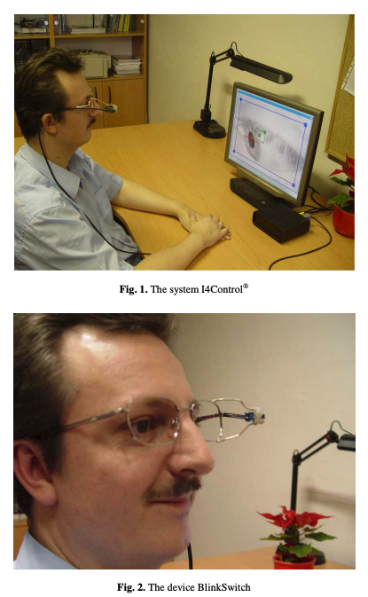

For the first phase of my City As Site project, I started by looking into an area of interest: using digital or other annotations in the real world for the purposes of accessibility or just as a form of amusement. In terms of amusement, this could be scavanger hunts that utilize QR codes or augmented reality apps that are triggered by "beacons" in the real world. For accessibility, this could be using the same elements (QR Codes, AR, etc) for the purposes of helped those with disabilities or even new to a city better navigate their surroundings. My search lead me to a very interesting journal on the subject: _[Computers Helping People with Special Needs](https://link-springer-com.proxy.library.nyu.edu/book/10.1007/978-3-540-70540-6)_

### Smart Environments

The first sections that stood out to me were those on the subject of "smart environments". These are environments that are augmented somehow with technology in order to aid the elderly or people unable to utilize all of their motor skills for any reason. This section covered some really interesting concepts such as "Smart Control". This included devices such as the _BlinkSwitch_ which allows people with motor skill deficiences to interact with light switches, electronics and other devices in their environment without requiring fine motor skills.

With devices such as blink switches, certain objects in the environment can be made to work directly with these "smart controls" to create a more accessible environment. However, given that these devices are less ubiquitious than regular smart phones, I would like to focus less on specialized devices for my project and more on the side of the environment.

### Environmental Annotations

While devices to interact with the environment are one side of this, another side is the annotations to the objects in the environment. This is the area I'd like to focus my work on, rather than the Smart Controls themselves, I'd like to explore to annotate the real world, whether by digital or good ol' fashioned physical means (i.e. stickers, surfaces, etc.), in such a way as to provide richer interactions with _any_ control devices (regular phones or just plain eyes). I am dubbing this **environmental annotations** for now. Through these annotations the environment and/or public spaces can become more accessible to those with disabilities. However, not entirely being for the disabled, I believe that **environmental annotations** can also be used to create amusing experiences for those without disabilities as well. Why focus on amusement at all and not just function? Well the side effect of an amusing application, alongside a practical one, is that it raises awareness more broadly of these accessibilities issues in our environment.

### Next Steps

Over the next few weeks, I will continue exploring these concepts and share the results here.
