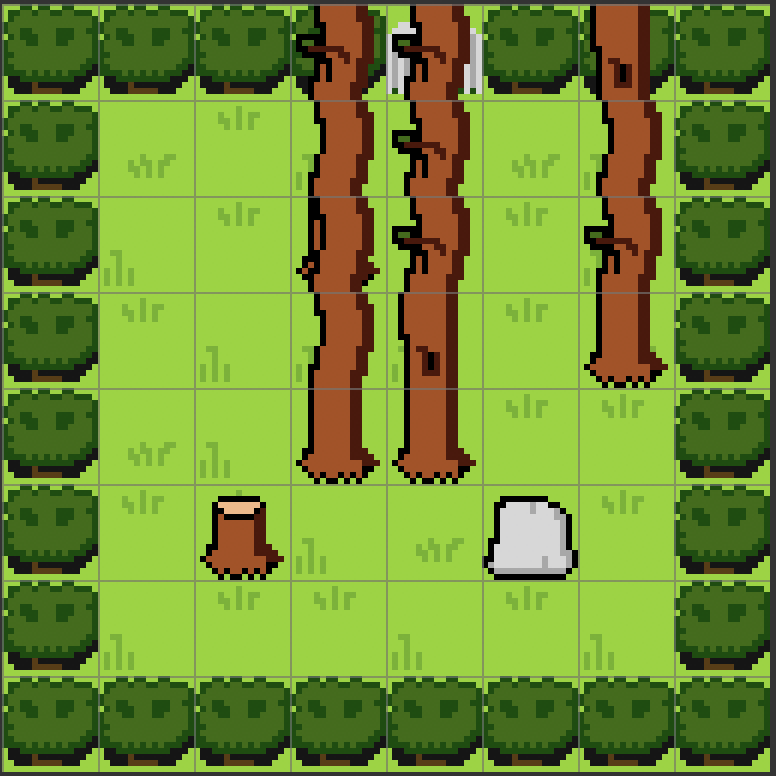
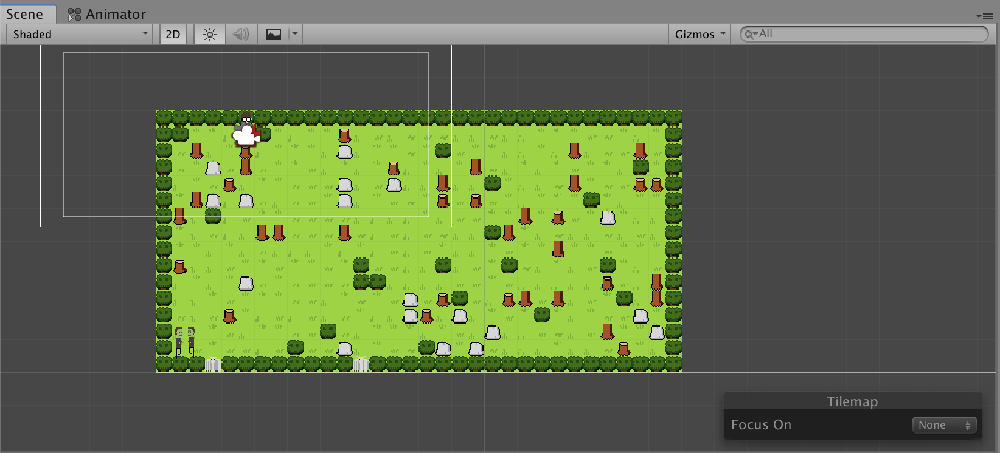
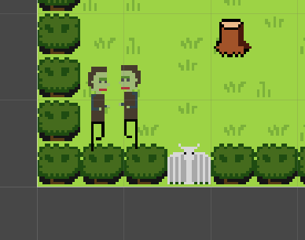
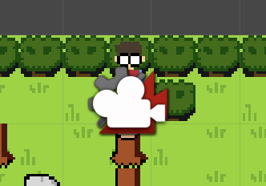
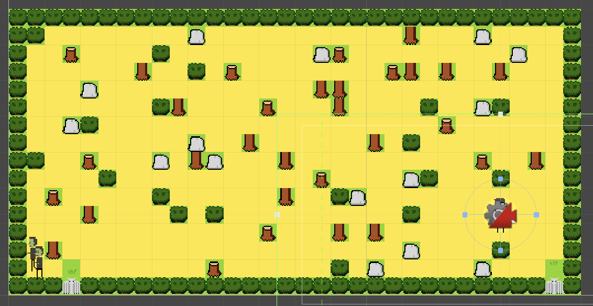

## Constant I/O (or Project 2, Part 2)

### Background

In part 1 of project 2, I studied the creative process of [Derek Yu](https://twitter.com/mossmouth?lang=en) with regards to Spelunky and read through [his book on the subject](https://bossfightbooks.com/products/spelunky-by-derek-yu). During that time, I paid close attention to the PGC (Procedurally Generated Content) approach he took to level building. From this I learned a few tricks that I applied to my own project.

### Procedurally Generated Levels

So from Derek Yu's book, I took away that he begins with a grid abstraction layer, somewhat decoupled from the game logic itself. I decided to start here, with the more abstract tool and work my way down to the more concrete (i.e. integration into a Unity project) afterwards.

To begin, [I setup a repo on Github for a more generic, CLI interface for level generation](https://github.com/omardelarosa/tilemapgen) with the intent of taking the core modules/classes and porting them into unity later. I called this [`tilemapgen`](https://github.com/omardelarosa/tilemapgen).

The core of this is a `PGCMap` class. ([github code link here](https://github.com/omardelarosa/tilemapgen/blob/master/src/PGCMap.cs)). This class serves as an abstraction layer that generates matrices (at the core). These matrices look like this:

```
W W W W W W W W W W W W W W W W W W W W W W W W W D W W W W W W
W       B   B B B     B     B     B         B   B .   B       W
W             B           B   B             B B   .         B W
W     B         B       B B B B B     B   . . . B .   B       W
W B   B         B   B B           B   . . . B . . . B     B B W
W     B             B           B   B .       B   B B B B B   W
W B   B           B                   . . B         B . . . . W
W         B B   B B     B B     B       . .         . .   B . W
W     B   B           B B               B . . . . . . B B . . W
W B B B     B B   B     B B   B   B       B       B B B   .   W
W     B B               B B     B     B   B B B B         . . W
W         B   B B B       B     B     B         B       B   . W
W B     B     B       B           B B     B B B   B       B . W
W       B B B     B B B                     B           B   . W
W   B     B B           B B   B B     B     B B       B . . . W
W W W W W W W W W W W W W W W W W W W W W W W W W W W W D W W W
```

Each character stands for a position in the matrix and the `Tile` enum at that location. For example, the `B` characters represent a `Tile.Barrier`, `W` a `Tile.Wall` and `.` a `Tile.Path`.

Using a series of helpers, like a `Graph` class, I generated an rudimentary pathfinding algorithm based on [Dijkstra's algorithm](https://en.wikipedia.org/wiki/Dijkstra%27s_algorithm) that traces a path from entrance to exit. These helpers are used to validate maps and make sure they're not impossible (or at least retry a few times in the attempt of making them possible.) Here's the implementation of dijkstra's algorithm that I used to validate maps. (True priority queue / minheap coming soon.)

```csharp
    public PathData<T> Dijkstra(T source, T target)
    {
        PathData<T> pd = new PathData<T>();
        HashSet<T> set = new HashSet<T>();

        // Initialize all routes
        foreach (T n in nodesList)
        {
            Guid id = n.GetGuid();
            pd.distances.Add(id, int.MaxValue);
            // pd.paths[id] = Node.NULL_GUID;
            set.Add(n);
        }

        // Set start to min
        pd.distances[source.GetGuid()] = 0;

        while (set.Count > 0)
        {
            Guid uid = pd.GetGuidOfMinInSet(set);
            set.Remove(Find(uid));

            // No edges containing uid case
            if (!edges.ContainsKey(uid))
            {
                break;
            }
            List<Guid> neighbors = edges[uid];

            // No neighbors case.
            if (neighbors.Count == 0)
            {
                break;
            }

            foreach (Guid nid in neighbors)
            {
                T n = Find(nid);
                if (n.IsNull())
                {
                    throw new InvalidOperationException("Node with id: " + nid + " not found during path data construction.");
                }
                Guid vid = n.GetGuid();
                int alt = pd.distances[uid] + Length(vid, uid);
                if (alt < pd.distances[vid])
                {
                    pd.distances[vid] = alt;
                    pd.paths.Add(vid, uid);
                }
            }
        }

        return pd;
    }
```

The map is also configurable for `NxM` dimensions and is generic enough to plug right into Unity. This makes it easy to scale up / down map complexity etc.

Here is a demo of the CLI in action:

 <iframe width="560" height="315" src="https://www.youtube.com/embed/5fb27mhTriY" frameborder="0" allow="accelerometer; autoplay; encrypted-media; gyroscope; picture-in-picture" allowfullscreen></iframe>

### Unity Integration

After this was mostly working, I had to bring this into Unity. Unfortunately, due to my lack of familiarity with C# in general perhaps, I didn't know of a simple way to share code between .NET so I just dragged and dropped these files into my Unity project.

Once these files were in my unity project, I started fixing a few bugs that arose from namespace collisions, etc and started work on some tiles. I settled on a simple forest tileset:


Here's a little demo map I made by hand using the tileset:



From this, I plugged in my code from the `tilemapgen` CLI and started generating some levels in Unity.



Each map also spawns players and enemies in a few random locations (though there is a bug where it seems to always start with the upper left and randomization needs to be added. Woops.)





Using the `PGCMap` class's properties, I also maintain simple subsets of "valid entity spawn points" (highlighted in yellow below):



These are places on the map that an enemy can be placed. In future iterations, it will be randomized and select only "accessible" points (i.e. that are on the same graph component as both doors). This logic is not complete yet, however.

### Results

So after getting all the tilemap logic to work, I put together a basic title screen that lets you select between "story mode" (i.e. the handmade maps mode from my previous demo) and "infinity mode" (i.e. the procedurally generated maps mode). I also added a few music tracks (not specifically made for this game, but just instrumental demos I had of unreleased music from the past couple years sitting on my hard drive.)

Here's a video of the end result in action working title "Shadow City" (not final):

<iframe width="560" height="315"  src="https://www.youtube.com/embed/tZjV9mImui0" frameborder="0" allow="accelerometer; autoplay; encrypted-media; gyroscope; picture-in-picture" allowfullscreen></iframe>

If you are interested in checking out for yourself, here is a dropbox link to a MacOS WIP build:

https://www.dropbox.com/sh/44c01zfi39k0jtx/AACoNwXmGrefrIgPxolLcozRa?dl=0

_NOTE: this link expires 5/31/2019. If you would like to download at a later date, please contact me directly via email and I can hook you up with hopefully a better version by then._
