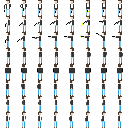

So up until now, I've been working with 32x32 pixel sprites. This follows a little closer to the tradition of many SNES JRPGs I love such as Chrono Trigger and Secret of Mana (a.k.a Seiken Densetsu).

As you might recall from [one of my other post about making sprites](/posts/process-organizing-sprite-sheets), these 32x32 pixel sprites look as follows:

Below are some of the animations created from the sprite sheet:

However, at 32x32 the animations for this can take quite some time. Even here at 4-frame animations in 8 directions, you have 4x8 cells of 1024 (32x32) pixels each. Making adjustments and coloring, shading, etc takes quite a bit of time for a solo developer with limited artistic chops and a full time day job.

Though [last week's experiment with Aseprite](/posts/constant-io-aseprite-animations) was successful in terms of generating a new hero avatar and some smooth animations, that level of detail and fidelity in 8 directions for a series of core movements doesn't quite scale given my work force size of 1. (Last week I produced only a single direction, though many more frames than in the examples I had before.)

## Subdivision

So this week, after doing a little bit of napkin math, I asked myself: what if I used 16x16 sprites? Going from 32x32 (1024 pixels per frame) to 16x16 (256 pixels per frame) is a huge reduction of 75% of total pixels in fact. Granted, these sprites have a reduced fidelity, but it's already a lo-fi game aesthetic I'm working with here.

After going through the above thought process, I ended up going ahead and building a few 8x8 sprite sheets of animations. (8 directions x 8 frames, rows x columns).

At first, I started with a base humanoid "Skeleton" of a character:

This in turn was scaled out to the 8x8 sheet for all directions and frames:

From here, I created the new leather-jacket and jeans hero character from last week as a 16x16 simplified version:

Here's a not-quite-finished sheet for the entire "shoot" action across all 8 directions of movement:

## Take Aways

Though each action is more "dense" here (i.e. 8x8 rather than 8x4 from the sheet above of the red-shirt character), I use layers in my image editor to swap out different arms/legs, torsos and its much more modular to add new actions using this system over the one before. This makes it simpler to pivot later on.

Furthermore, this system relies on more minor color palette variations to suggest "depth". (Notice the different shades of blue for the diagonal state of the jeans and the subtle skin tone differences to denote subpixel "edges" between the head and neck.) This aesthetic is closer to where I'd like to end up without using black borders on the graphics and sticking primarily to using colors to suggest edges/borders.

Even though quite a bit of detail is lost here, I'm satisfied with the result. From here I will need to downsample the tilemaps a bit more to maintain the scale from before. This will require a few 8x8 tilesets and maps to be created.
