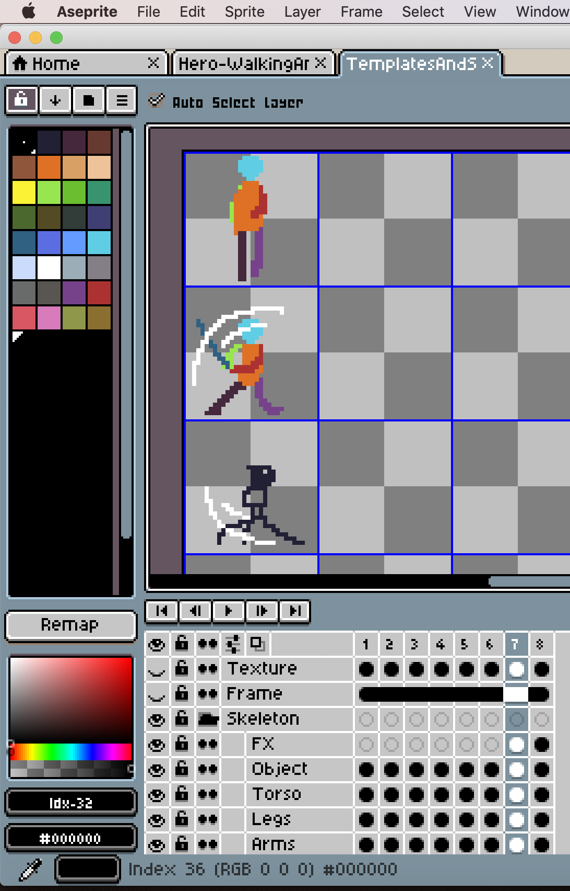
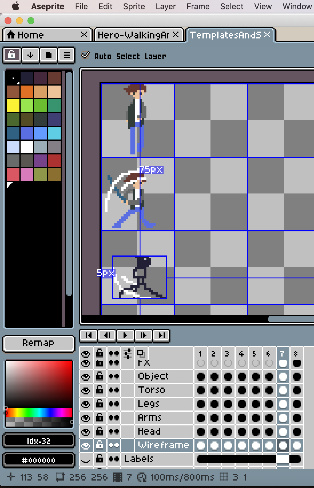
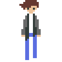

## Aseprite

This past week, I decided to finally give [Aseprite](https://www.aseprite.org/) a try. It seems like a lot of YouTube pixelart tutorials use this over [PyxelEdit](https://pyxeledit.com/) (which is what I've been using thus far) and it seems to have some useful features for animation like onion skinning. It also has some options for scripting, which I'd like to take advantage of in the near future. Anyway, this week, as I thought about beefing up my pixel art sprites for players, etc, I used exclusively Aseprite.

Using Aseprite, I built "wireframes" and "skeletons" of my animations before adding a "texture" layer on top. Here's what the two look like:

#### Untextured

#### Textured

## New Sprites

After settling into Aseprite. I decided to rethink my main player avatar design. Up until now, I've used the following player avatar (made in PyxelEdit):

However, this player avatar is a bit generic. It doesn't necessarily fit the theme of the game I've been aiming towards. The theme being a semi-survival-horror concept with zombies, vampires etc.

For that theme, I feel like the character I have created doesn't fit every situation. For one, the large glasses have limited what I could do with face animation in such as small, 32x32 pixel sprite.

With that in mind, I decided to sketch out some ideas of a character with a bit more room for facial expression and attire.

Using Aseprite, these were much quicker to animate imo. However, my grid organization system won't exactly work here so I will have to rethink how to keep these animations more organized in the future.
