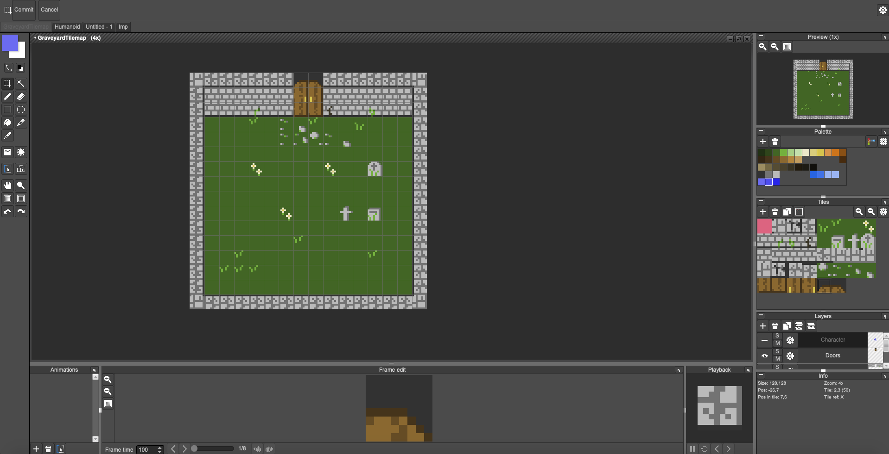
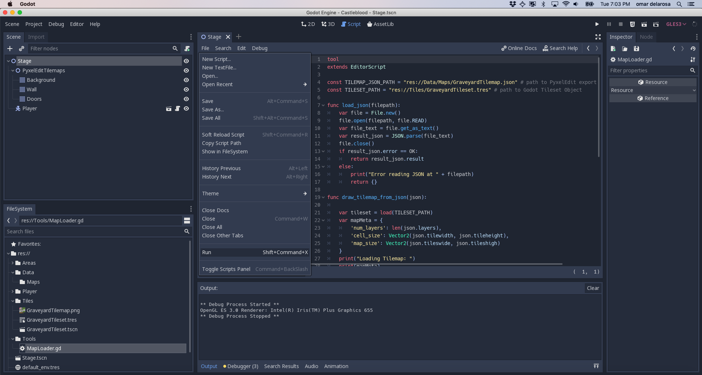
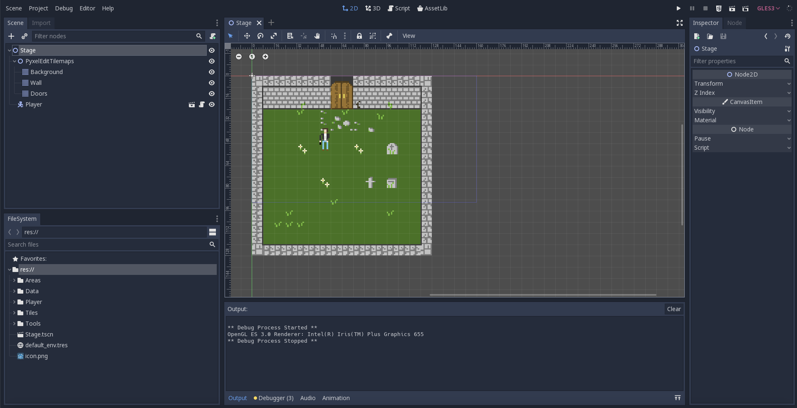

After watching [several](https://www.youtube.com/watch?v=O0KZVBPaxSk) [videos](https://www.youtube.com/watch?v=uSDVA5CQBu8) on the matter the past couple weeks and managing the general overhead of Unity, I finally made the switch to Godot engine. It's not that there's anything particularly bad about Unity (it's a great tool), but my own "outsider" status to indie game development and background as a non-game-oriented programmer made several things about Unity feel very rigid and incompatible with my own workflows. Here are a few issues:

### 1. Command line script execution

I enjoy prototyping helpers and utilities in my programs from the command-line level before integrating them into the larger project. For example, [when I worked on procedurally generated levels a few posts back](/posts/constant-i-o-procedurally-generated-levels), I began with a C# CLI tool first. Then I integrated into my Unity project. However, that is not super straightforward without geting .NET involved and creating mocks for `UnityEngine` constructors and namespaces like Vector3 (or implementing your own as temporary placeholders in your CLI before importing). Compared to working in Python, C++ or Node (my primary languages beyond C#) this felt cumbersome. Unity basically made it difficult for me to workoutside the editor.

Meanwhile, [Godot very simply supported a CLI mode](https://docs.godotengine.org/en/3.1/getting_started/editor/command_line_tutorial.html) that let me execute GodotScript files from the command-line trivially. All I had to do (working from MacOS) was:

```bash
# Setup a symlink
ln -s /Applications/Godot.app/Contents/MacOS/Godot /usr/local/bin/godot
```

And then:

```bash
# Execute my godot script file directly from the cli
godot -s helloworld.gd
```

That's it. My script is fully executable on its own out of context. This jives better with my unix-philosophy leanings when it comes to programming.

### 2. Simpler Tilemap APIs

With Unity, it took quite a bit of work to import tilemaps seamlessly into Prefabs and game objects. I even had to write a wonky custom UI extension. It's not impossible, but this process was way way simpler in Godot. In Godot, I made a simple script of ~100 lines of code and simply executed it. And voila. My PyxelEdit map was instantly available as Nodes in the game context:



_First I built a tilemap in PyxelEdit_



_Then added the files to my project and executed my custom script_



_Voila. Easy PyxelEdit tilemap import_

(For the script code, visit [this Gist on github](https://gist.github.com/omardelarosa/c576329e1481351f40d1901e80ba227f))

### 3. Less Dragging and Dropping, More Programming

Unity always feels like it wants me to spend more time in its UI dragging and dropping and navigating menus. Meanwhile, Godot lets me script anything and everything easily without hassle. When it comes to blend trees and animations, Unity feels very heavy weight. I spent a lot of time dragging and dropping sprites to make animations and it really slowed down my prototyping process. Meanwhile, in Godot, with a simple Texture swap and carefully written player node scripts, I was able to implement the twin-stick, gun logic from my game in a few lines of code and with little more than the raw PNG texture atlases.

<iframe width="560" height="315" src="https://www.youtube.com/embed/2jQk_HQJcjo" frameborder="0" allow="accelerometer; autoplay; encrypted-media; gyroscope; picture-in-picture" allowfullscreen></iframe>

## Unity and Godot are Not Mutually Exclusive

Overall, I still think Unity is awesome. I'll keep using it for other projects and maybe roll this game back into Unity. It's cross compilation for platforms seems unrivaled and seems like the simplest way to actually ship production-ready games. However, in the short-term, I think the move to Godot will definitely speed up my prototyping and allow me to focus more on adding content to the game without so much slow, dragging and dropping. Especially for 2D game development.
