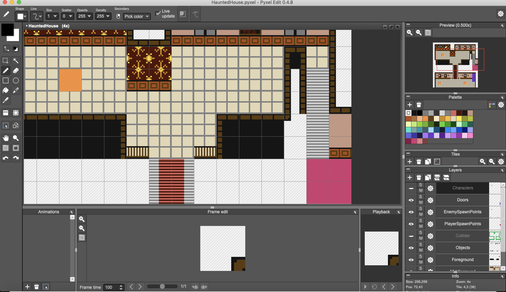
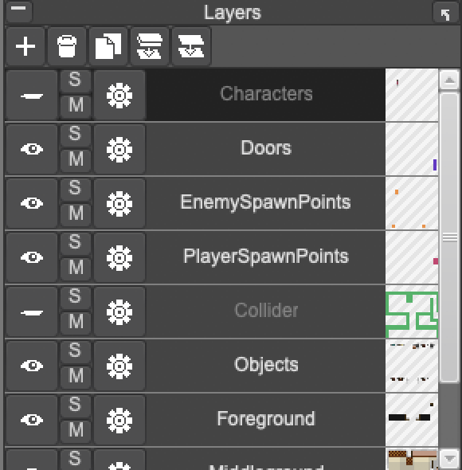
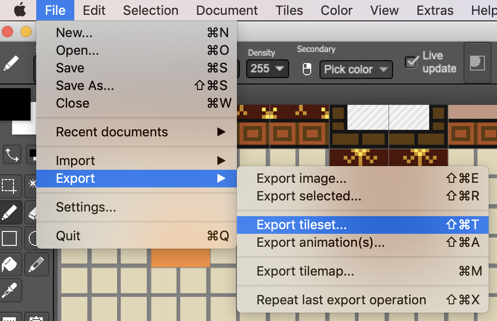
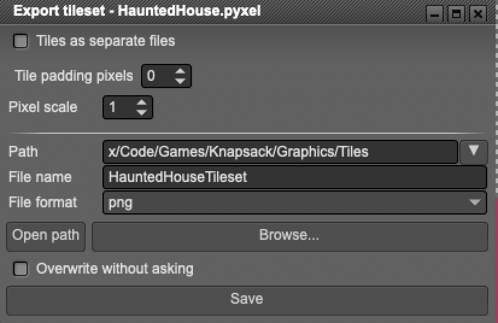
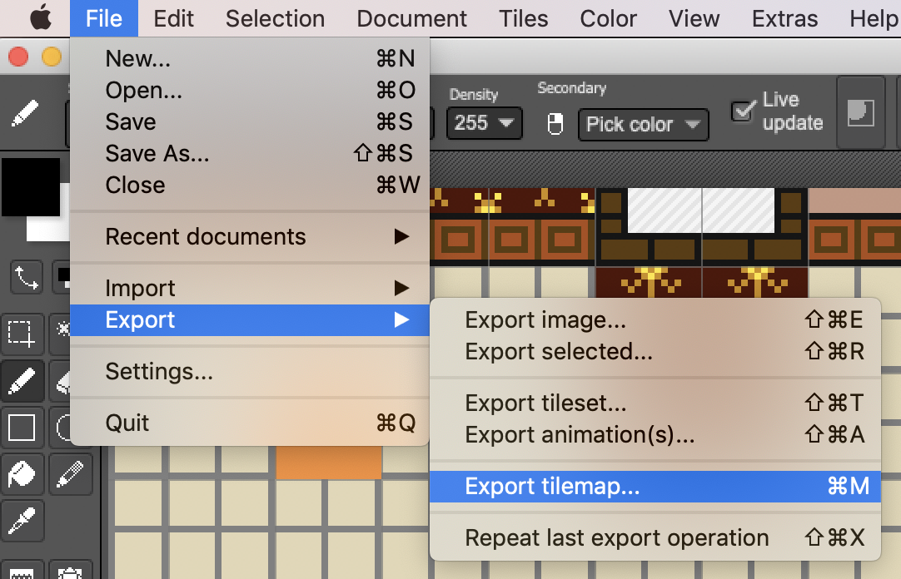
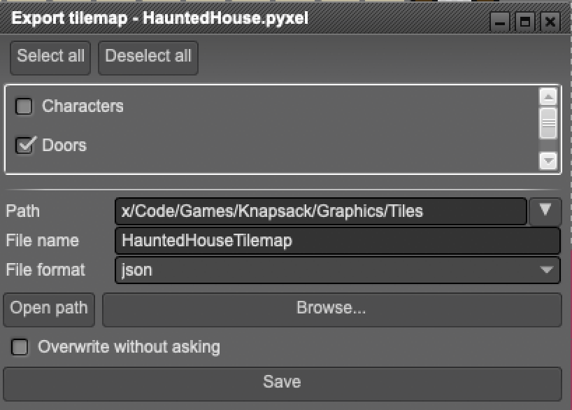

Thus far, all of the pixelart you've seen on this site and in the game screenshots thus far has been made using PyxelEdit. This is an awesome tool, but when it comes to integrating directly with Unity it does have a few limitations. Though not overtly bad, there isn't a one-shot way for me to add a tilemap directly into unity.

Although I found a semi-okay PyxelEdit tilemap importer on the unity asset store, it failed to create objects using the new-ish `UnityEngine.Tilemaps` module, which is ultimately what I wanted to use. Naturally, I ended up making my own importer script.

### Drawing and Exporting The Tilemap Data

The first step is drawing the tilemap in PyxelEdit.

Once I have my map looking as expected, I make sure all my layers were coherently set up.

After that, I begin exporting the pieces, starting with the tileset image asset:

Once that's out in file form, I export the tilemap data as JSON:

This leaves me with two files that I import into Unity via drag 'n drop:

Afterwards, using [a custom C# sharp script extension I wrote for unity](https://gist.github.com/omardelarosa/859a05f8881fe089f7e389b399f690bb), I drag and drop them into the custom GUI window and build the map:

<iframe src="https://www.youtube.com/embed/nooMScdCLU4" frameborder="0" allow="accelerometer; autoplay; encrypted-media; gyroscope; picture-in-picture" allowfullscreen></iframe>

The end result (using a small test build), with player and enemy sprites added, ends up looking something like this:

Now to build some actual AI for these zombie enemies so they don't wander around so aimlessly.
