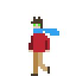
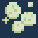
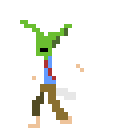
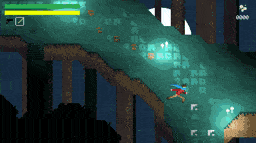

For the past few weeks, I've been working on my first game project in [Godot Engine](https://godotengine.org). It's inspired (broadly speaking) by SNES action RPG games, but I plan on taking advantage of some of capabilities of modern hardware to make it more like an SNES++ game.

### The Story

In the game, you play as a hiker named _Beat_ who loses their way during a hike and finds themselves in a research camp.

The scientists at the camp seem to be investigating the presence of a strange organism called **Moonspore™**, which somehow Beat also seems to be drawn to.

Beat quickly discovers that some scientists have become infected by an organism that's taken over their mind and made them feral.

Using weapons found or purchased from not-yet-feral humans using **Moonspore™**, _Beat_ must survive.

You can see a brief playthrough of my first test-level here:

<iframe width="320" src="https://www.youtube.com/embed/FoeoJDRplH4" frameborder="0" allow="accelerometer; autoplay; encrypted-media; gyroscope; picture-in-picture" allowfullscreen></iframe>

### The Future

I hope to have more updates to come soon and I will be publishing a demo to [my itch.io channel](https://nabisco.itch.io/) real soon. In the meantime, be sure to follow my itch.io channel. My username there is _nabisco_. Or drop me a line with your feedback by one of my many social channels.
