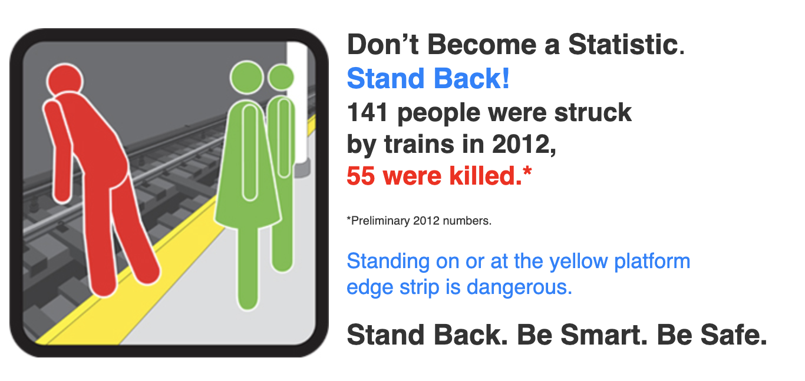
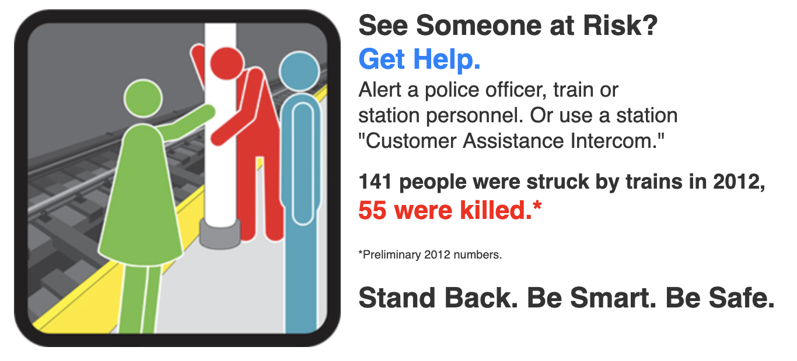
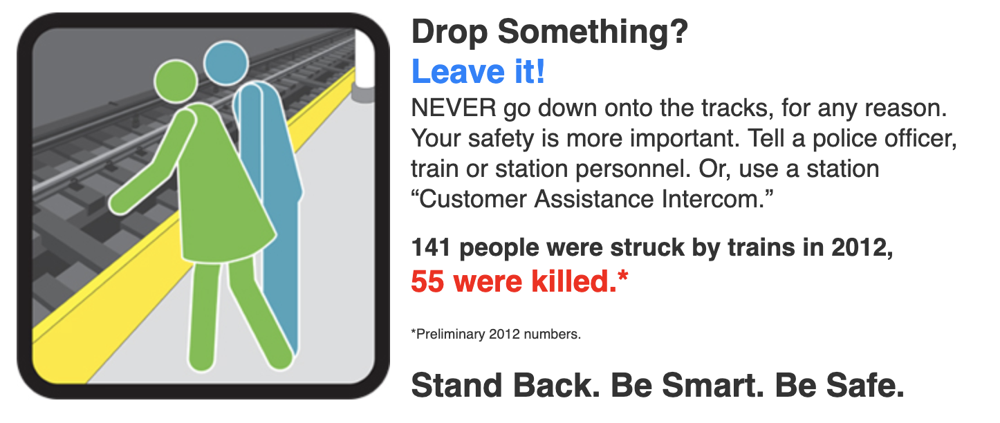
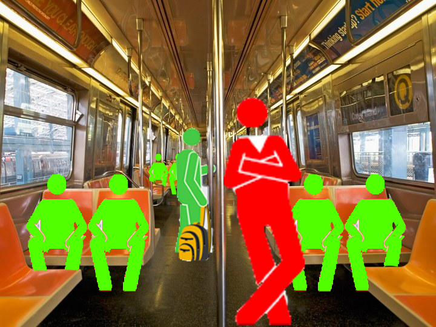

## Background

For the past few weeks, I've been reading a variety of articles and books on the application of augmented reality and other forms of unique human computer interactions. My focus has broadly been on the application of these technologies to make public spaces "annotated" in some way for those who are either impaired or unable to access information in the same way as others. From this broad concept, I decided to focus my research on a single public space that I spent a good chunk of each day in: the NYC subway.

## The Status Quo

In its present state, the subway actually has a large amount of "low tech" annotations. These take the form of posters or announcements played through loud speakers. The MTA does a great job of translating posters into multiple languages, however, that doesn't entirely mean non-literate speakers of other languages will have access to their message. Thankfully, the MTA's designers have done a great job of illustrating most of their ideas:

_Fig. 1a_

_Fig. 1b_

_Fig. 1c_

The posters in Fig 1 use vivid colors and carefully written copy in order to draw the attention of subway straphangers. In some cases, these are even translated to other languages to make them even more accessible, for example Fig. 2.

_Fig 2._

However, there are limits to how accessible these posters are.

1. They only target a handful of languages, all of them relatively mainstream.
2. They assume literacy in the target reader.
3. They rely on cultural cues such as red/green colors meaning go/stop.
4. They can be difficult to see for those with certain forms of colorblindness.

These four problems can be addressed through technology.

## Overlay Images

The concepts from these signs can be translated into digital annotations that can be applied to screens such as mobile phones using augmented reality technologies. This technique, taken from educational applications is called adding **Overlay Images** to the real world:

_Fig 3a_

_Fig 3b_

The goal here is to show some of the same informational messages provided by posters and announcements in a more accessible way that's provided directly by the screens or devices of straphangers. These overlays in Fig 3 can easily be "localized" for their own language trivially or adjusted colorwise for the visually impaired. These types of **Overlay Images** can be updated easily, animated and can be adapted to be more animated and playful for general audiences and be made easily more accessible to audiences with specific accessibility needs.

## Implementation

Implementing these annotations can be done in a number of ways combining newer augmented reality APIs available for most mobile devices. First would be utilizing **trigger images** placed in the environment ahead of time to simplify and stabilize digital image placements in the app viewport as in Fig 4 below.

_Fig 4._

These AR Stickers in Fig 4 can interat with Augmented Reality APIs as places where digital images and animations can be placed in the environment.

_Taken from [here](https://edu.google.com/products/vr-ar/expeditions/?modal_active=none) so as not to post media directly from the academic article._

This is how many current education applications work right now, but the process could be adapted for a more broad definition of education. Education as a concept is broadly though of in terms of schools and academic topics such as math, language or the sciences. However, when taken on a micro scale each of these AR experiences in public spaces can be thought of as micro-education opportunities that are in fact more modern and accessible than strictly print-based solutions.

## Project Prototype Concept

Based on these research results above, my goals and deliverables would be as follows:

1. Build a prototype of an application that provides these "guides" using augmented reality for a single space such as the subway.

2. Create a series of context-agnostic sticker designs to allow the image triggers to scale out and function in nearly any environment around the city. (Though I'd still preserve a consistency across them visually.)

3. Deploy stickers in a single space (such as a subway platform) and record a demonstration of how the application could provide guides.
