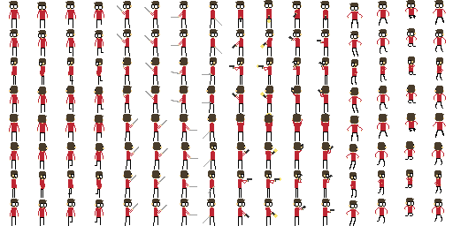
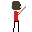
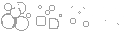
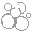

For the first entry, I decide to create a few pixelart sprites to use in Unity game prototypes. They are based on an organizational system that uses rows to distinguish angles and column groups of 2 to 4 to distinguish individual frames in an animation. This makes the code for sprite generation simpler to reason about using meaningful indices.

#### Player Avatar

The first is a pixelart player avatar for a game that can move in 8 directions and handles two basic actions: shooting and striking with a sword/melee weapon.

Below are some of the animations created from the sprite sheet:

#### Smoke

The second was a very simple smoke cloud to be used on objects that go "poof"

Here is the animated gif form:

