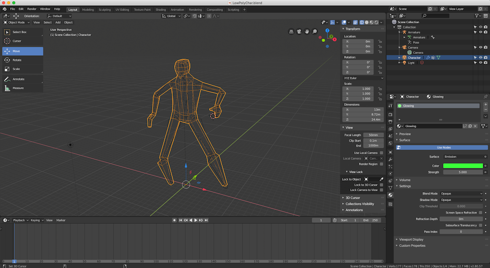
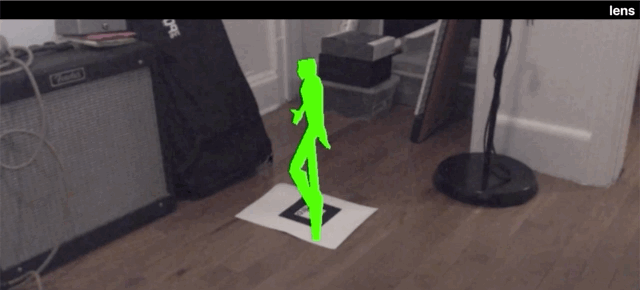

This week I made a lot of progress on [my aforementioned AR-themed project](http://localhost:8000/posts/final-project-research-phase) and started getting a basic web-app running. I decided to go with a web-app primarily to avoid native-app downloads. The Vuforia API I had previously used in the Unity context, while very very powerful for something like a game or a "larger" project, I don't see this project as being too computationally expensive at the end of the day and requiring such a large library.

## Using Open-Source Web Tools

Even without Vuforia, I still didn't abandon tooling altogether. Instead, I simply focused on using _exclusively_ open-source tooling for the browser. I started my search [with Jerome Etienne's AR.js boilerplate](https://github.com/jeromeetienne/AR.js). Why? Well as he puts it:

> Very Fast : it runs efficiently even on phones - 60 fps on my 2 year-old phone!

> Web-based : It is a pure web solution, so no installation required. Full javascript based on three.js + jsartoolkit5

> Open Source : It is completely open source and free of charge!

> Standards : It works on any phone with webgl and webrtc

With Jerome's github repo as a guide, I set up a simple a simple React + TypeScript app using:

```bash

npx create-react-app my-app --typescript
```

Although I started with the packaged, NPM-versions of modules, I had a hard time fitting all the dependencies together neatly (`THREE.js + jsartoolkit + jerome's boilerplate != success`). I ended up having to just use in-line `<script>` tags for now connected to specific builds of all the dependencies, they one being this:

```html
<script src="https://raw.githubusercontent.com/artoolkit/jsartoolkit5/master/build/artoolkit.min.js"></script>
```

Turns out, the custom emscripten build of artoolkit is critical for all this to work. Once that was in place, I had a pretty decent little Web App shell for the project up and running that I deployed to [Netlify](https://netlify.com).

## 3D Modeling

Naturally, the web app portion was super simple given that's actually my day job, but the 3D modeling that took me the longest. I started by downloading [Blender](blender.org). It's open-source, free-to-use license appealed to me. However, it has a pretty steep learning curve.

After some careful googling, I found a few videos to help point me in the right direction. Most notably these videos:

1. [Easy Quick Low Poly Rigging Tutorial](https://www.youtube.com/watch?v=cp1YRaTZBfw)
2. [Leg IK Tutorial](https://www.youtube.com/watch?v=gH5uATTTYB4)
3. [Walk Cycle Tutorial](https://www.youtube.com/watch?v=DuUWxUitJos)

From those videos, I was able to put together a somewhat decent, humanoid model in blender with a simple rig:



I'm still not done with the animations, but I've got most of the boilerplate ready to go for animating soon.

## Putting it together

After the model was setup, I had to bring it into the web app. This involved exporting to a `.gtlf` file. I settled on this instead of Collada files since I couldn't quite get Collada files to work well with THREE.js and it seemed as if the web "standard" is heading toward a `.gltf`-direction.

Anyway, while I'm not entirely done, here's where I am so far:



A semi-live demo is also available at:

**[lens.delarosa.io](https://lens.delarosa.io)**

Just note: you will need to either print out a Hiro target or use Jerome's:


