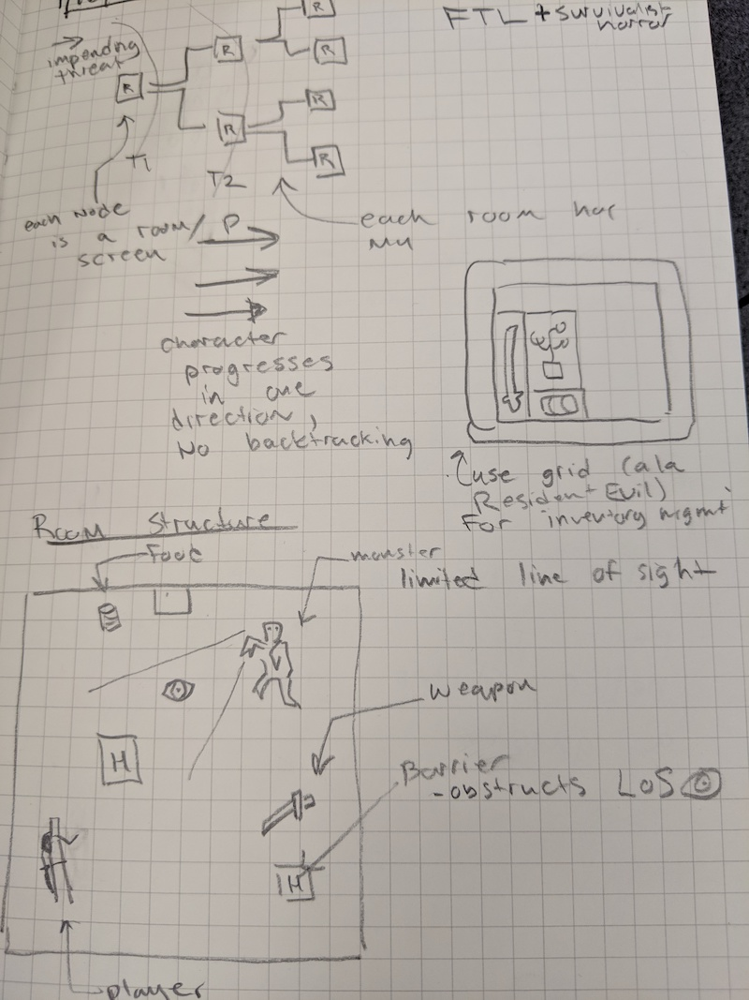

This sketch is a pretty high-level concept diagram for what this game could become. Obviously, I'm ripping off ideas from FTL and Resident Evil here. Something of a hybrid would be cool (though admitedly ambitious hehe, since anything a 1/10th as good as either would be awesome to me):

