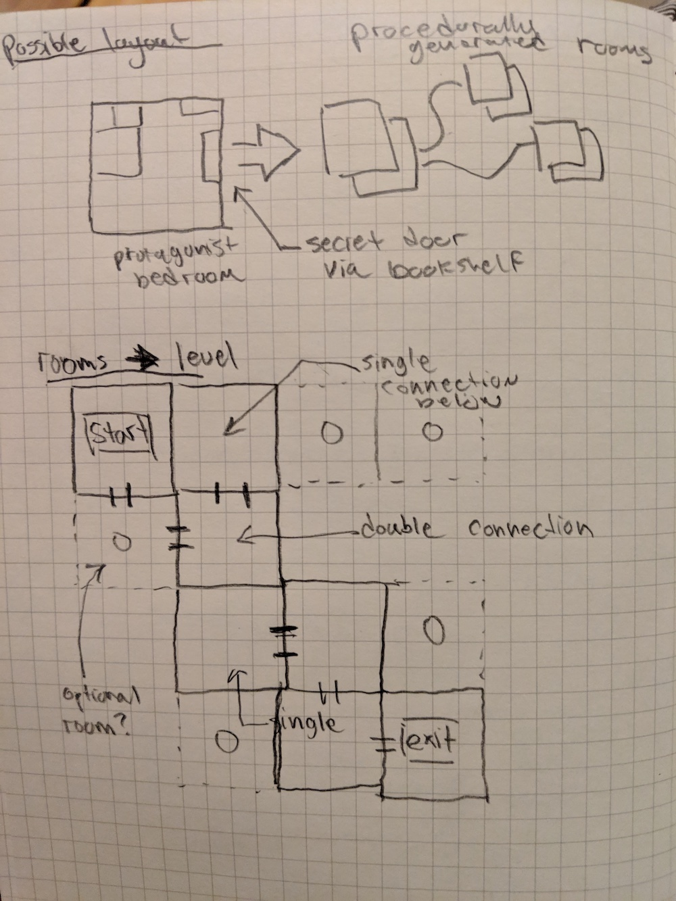

I just finished reading Derek Yu's book on Spelunky and I'm fascinated by his PGC (procedurally generated content) approach to level building. While it wouldn't work wholesale for the game I'm working on, it does have some neat ideas.

This week's sketch is an outline of how it can perhaps be done in two-dimensional, overhead view level design. This assumes a 4x4 level made up of "room" squares (each one 16x16 tiles of 16x16 pixel sprites)

