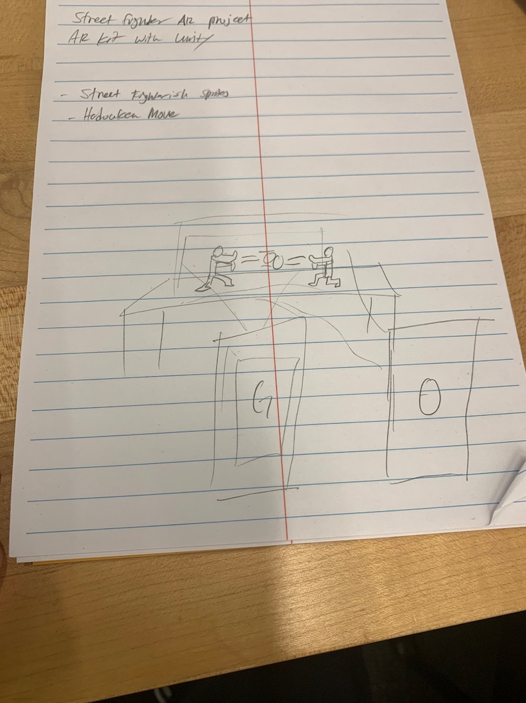

_(Written by Omar Delarosa and Grant Ng)_

# Birth of our conecept

After our interview with each other we quickly realized that we both have a shared affinity for fighting games. Omar is a big fan of old school super nintendo games and Grant is a big fan of street fighter. We both have a background in development with Unity. Omar is just getting into Unity, although he has an extensive background in CS. Grant has more of a design background but has a lot of experience developing in Unity.

# Our steps

Our first set of of steps was to decide what we want to create. Since we both liked fighting games and we both have experience with Unity, we figured that we could do something novel with Unity. Omar was interested in using AR and VR from his previous classes. Grant has VR and AR experience as well working at Pratt and from previous projects at the school.

We decided that we should create an AR fighting game that incorporates multiplayers to fight with one antoher. We initially thought that a flat 2D sprite would be a cool idea so project. Like having a flat image of Ryu appear on the table or any flat surface and the player can make him shoot a fireball. Omar also wanted to incorporate his program that generates a random texture map everytime the scene loads. Omar also wanted to go into using websockets which will create a host server that we both can connect to through Unity.

# First iteration

We created a simple version of just using simple shapes to represent the fighter and the fire ball. The randomized tree placement was working, but no models for trees were added just yet. We wanted to focus on getting the controls set up and getting the random texture map to work. We spent about two days to set this up and came up with this first iteration:

<iframe width="560" height="315" src="https://www.youtube.com/embed/0GbBLX5jZUs" frameborder="0" allow="accelerometer; autoplay; encrypted-media; gyroscope; picture-in-picture" allowfullscreen></iframe>

# Second iteration

After our first build we decided to narrow our scope and just focus on the essentials for animations and interactivity. Grant had imported a simple 3D model with three animation: A running animation, fire ball animation and idle animation. All the animations were created in mixamo and tweaked a bit in Maya with the skeletons. Omar found that WebSockets are not accessible directly from Unity, so multiplayer was not as straightforward as expected and dropped. However, the tree models were added and AR plane detection integrated into our previous iteration.

# Final Result

The final result ended up with the following:

-   AR ground plane detection using Vuforia's API
-   mixamo 3D model with animations
-   Procedurally generated trees
-   The ability for the player to navigate the environment
-   Touch Controls

<iframe width="560" height="315" src="https://www.youtube.com/embed/uXOvO1WRHN4" frameborder="0" allow="accelerometer; autoplay; encrypted-media; gyroscope; picture-in-picture" allowfullscreen></iframe>
