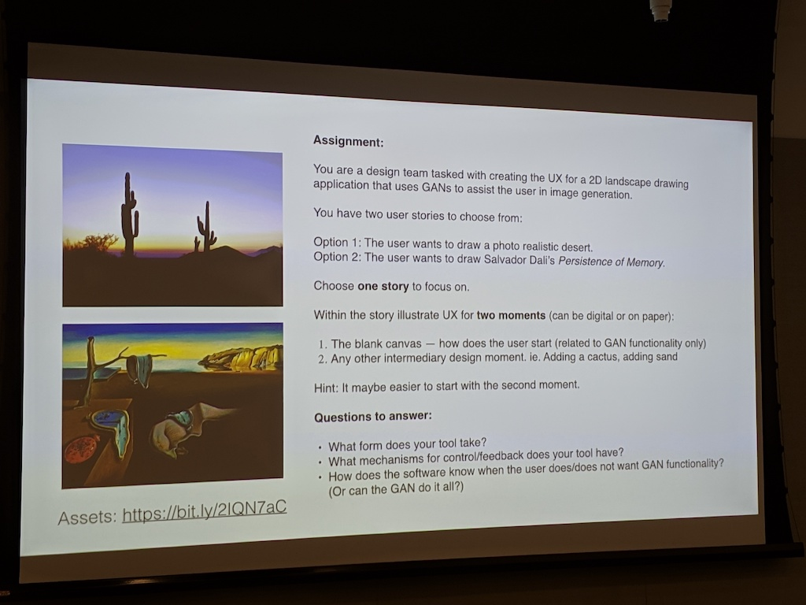
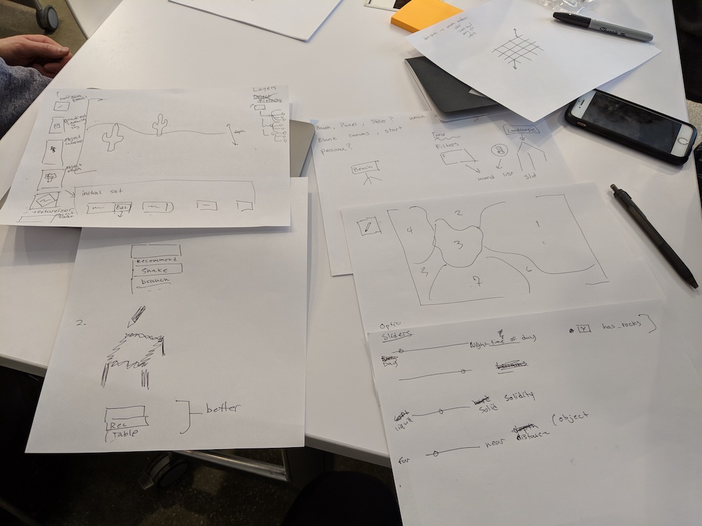

The week before last on 4/29/2019, I attended a really awesome talk at the [NYU MakerSpace](https://engineering.nyu.edu/research-innovation/makerspace) called [_Designing for Machine Intelligence with Adobe's Design Team_](https://www.eventbrite.com/e/designing-for-machine-intelligence-with-adobes-design-team-tickets-59924565990). The talk was lead by two members of Adobe's Design Research team: [Lisa Jamhoury](http://lisajamhoury.com/) and [Patrick Hebron](https://www.patrickhebron.com/) The talk was actually a sort of hybrid of a talk and workshop. The first half being a straight-up talk and the second being more of a workshop.

## The Talk

The first portion (the talk), was a really great disambiguation of Machine Learning and Neural Networks by Hebron. In that portion he did a good job of taking these relative niche concepts and breaking them down into very accessible terms. In one slide, he had a made a very insightful observation about how conventional programming is a form of inductive reasoning while learning systems (machine learning / neural networks) are a more a form deductive reasoning, turning observations into generalizations/instances.

_via [Patrick Hebron's Website](https://www.patrickhebron.com/learning-machines/week1.html)_

He mentioned that in conventional programming, a programmer must understand the "general cases" of a program before setting out to write code that expresses the program. Where as learning systems begin with many many examples of problems and from that derive program, without a general case. Because of this, conventional programs and machine learning algorithms differ in these two ways:

_via [Patrick Hebron's Website](https://www.patrickhebron.com/learning-machines/week1.html)_

In general, his talk was a very well organize crash course into what learning systems are and it more-or-less mirrored the content of [one of his blog posts on the subject](https://www.patrickhebron.com/learning-machines/week1.html).

## The Workshop

The workshop portion of the event was mostly lead by [Lisa Jamhoury](http://lisajamhoury.com/) and [Patrick Hebron](https://www.patrickhebron.com/). This portion challenged the attendees to design a UI based on two user stories she provided.

From this prompt she split us up into a small group that brainstormed about solutions. After about 45 minutes, my group came up with a handful of sketches for a UI concept of a GAN (Generative Adversarial Network)-powered, image editing canvas:

Overall, the experience was quite a blast. I hope they come back and do more events at NYU.
