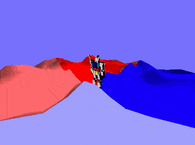
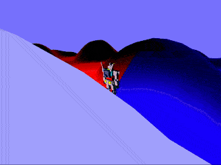
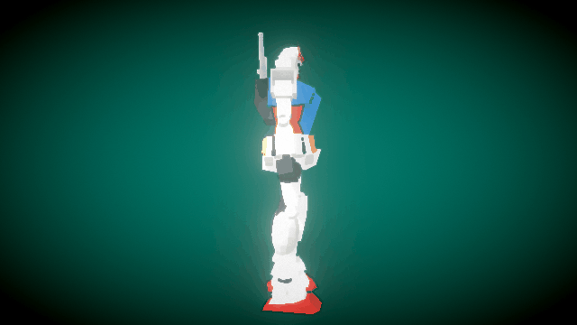
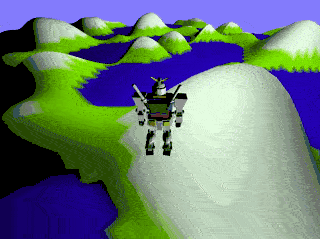
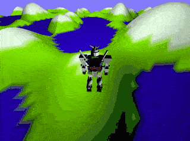
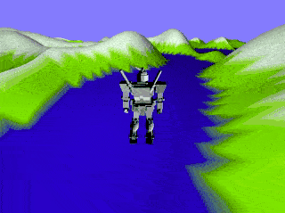
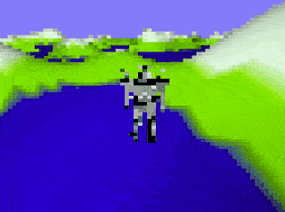

_I just finished another semester of grad school and this is the first of hopefully a few blog posts where I share some of the assignments I did this semester in my classes. This one is from a Computer Graphics course._

### 1.0 - Introduction

When I started this project I set out to make a simple interactive graphics program (I'm heistant to call it a game because of its simplicity) using OpenGL that renders an infinite mesh of procedurally generated terrain using:


_[Perlin noise](https://en.wikipedia.org/wiki/Perlin_noise)_

This mesh would represent a terrain stretching out in all directions that a player avatar could move on:


It would have certain regions that would be water and somehow impenetrable (the player character does not know how to swim perhaps.)


From this concept, I set out to write a simple program without any frameworks and in as vanilla of C++ code as possible (though it is based on a fork of [some boilerplate code provided by one of my professors that you can find here.](https://github.com/jccosta/CS-GY-6533))

### 1.1 - Terrain Mesh Generation

First I generated my basic geometry.

A single, larget terrain mesh is generated as a series of NxM vertices in the `x` and `z` directions in world space with the `y` component generated as a call to a perlin noise function `noise_callback()`.

```cpp
void Mesh::generateVertexes(unsigned int w, unsigned int h) {
    // Create vertices
    vertices.reserve(w * h);
    float spacing = 1.0;
    // Rows
    for (int r = 0; r < h; r++) {
        // Cols
        for (int c = 0; c < w; c++) {
            // NOTE: origin is not at center of mesh
            float x = c; // col
            float z = r; // row
            float y =
                noise_callback( // perlin or other noise func
                    (float)c / w, // x
                    (float)r / h // y
                    );
            glm::vec3 v(x * spacing, y * spacing, z); //
            vertices.emplace_back(v);

            // Vertex colors not supported!
            vertex_colors.push_back(glm::vec3(0.0, 0.0, 0.0));

            // Create a vector in the mapping
            vector<int> triangles;
            vertex_to_triangles_map.emplace(vertices.size() - 1, triangles);
        }
    }

    // Generate faces

    // Rows (-1 for last)
    for (int r = 0; r < h - 1; r++) {
        // Cols (-1 for last)
        for (int c = 0; c < w - 1; c++) {
            // Upper triangle
            /*

                v0 -- v2
                |    /
                |  /
                v1
            */
            int f0_0 = (r * w) + c;
            int f0_1 = ((r + 1) * w) + c;
            int f0_2 = (r * w) + c + 1;
            glm::vec3 f0(f0_0, f0_1, f0_2);
            faces.push_back(f0); // TODO: emplace

            // Lower triangle
            /*

                      v2
                     / |
                   /   |
                v0 --- v1
            */
            int f1_0 = ((r + 1) * w) + c;
            ;
            int f1_1 = ((r + 1) * w) + c + 1;
            int f1_2 = (r * w) + c + 1;

            glm::vec3 f1(f1_0, f1_1, f1_2);
            faces.push_back(f1); // TODO: emplace
        }
    }

    // Post-processing code
}
```

### 1.2 - Terrain Mesh Instancing & Mirroring

The generated terrain mesh is then used to create 9 instances of a `SceneObject` representing the entire surface with a single set of vertexes and reducing the need to transfer geometry back and forth from GPU. Each instance would have different orientation according to their relative position in the grid as follows:

| `(x,y)` | -1             | 0             | 1              |
| ------- | -------------- | ------------- | -------------- |
| **-1**  | `MIRROR_3D_XY` | `MIRROR_3D_Y` | `MIRROR_3D_XY` |
| **0**   | `MIRROR_3D_X`  | `MIRROR_NONE` | `MIRROR_3D_X`  |
| **1**   | `MIRROR_3D_XY` | `MIRROR_3D_Y` | `MIRROR_3D_XY` |

This mirroring can be generalized across the entire grid of the world coordinates using the following algorithm (pseudocode)

```python

float get_mirroring(int x, int y):
    # Set mirroring
    # Case 1: both are odd
    if x % 2 != 0 and y % 2 != 0:
        return MIRROR_3D_XY
    # Case 2: y is odd, x is even
    elif y % 2 != 0 and x % 2 == 0:
        return MIRROR_3D_Y
    # Case 3: x is odd, y is even
    elif x % 2 != 0 and y % 2 == 0:
        return MIRROR_3D_X
    # Default Case: no mirroring, both x & y are odd
    else:
        return MIRROR_3D_NONE
```

Using a simple asynchrnous update coroutine in the player movement function, we can keep the terrain self-updating and mirroring as the player moves. That only requires translation of mesh tiles that are more than 2 tiles away and leaves current and adjacent tiles untouched.

In context:

```cpp
void updateTerrain() {
    // Adding mutexes to allow for safe, multi-threading
    if (!terrain_update_mutex.try_lock()) {
        return;
    }

    for (int i = 0; i < terrain_objects.size(); i++) {
        SceneObject *so = scene_objects.at(terrain_objects[i]);
        glm::vec2 so_loc = so->getWorldGridPos(XMAX - 1, YMAX - 1);
        glm::vec2 p_loc = player->getWorldGridPos(XMAX - 1, YMAX - 1);
        glm::vec2 dir = p_loc - so_loc;
        float x_dist = dir.x;
        float y_dist = dir.y;
        glm::vec3 t(0.0f, 0.0f, 0.0f);

        if (abs(x_dist) >= 2.0) {
            float x = (glm::sign(x_dist) * 3.0f) * (XMAX - 1);
            t.x = x;
        }

        if (abs(y_dist) >= 2.0) {
            float y = (glm::sign(y_dist) * 3.0f) * (YMAX - 1);
            t.z = y;
        }
        if (abs(x_dist) > 0.001 || abs(y_dist) > 0.001) {
            so->translate(t);
        }

        glm::vec2 so_next_loc = so->getWorldGridPos(XMAX - 1, YMAX - 1);

        /*

            Mirroring is applied to whichever the odd-numbered
            grid coordinate is.

        */

        // Case 0: No mirroring
        glm::mat4 mirroring_mat = MIRROR_3D_NONE; // No mirroring by default

        // Set mirroring
        int so_x = (int)so_next_loc.x;
        int so_y = (int)so_next_loc.y;
        // Case 1: both are odd
        if (so_x % 2 != 0 && so_y % 2 != 0) {
            mirroring_mat = MIRROR_3D_XY;
            // Case 2: y is odd, x is even
        } else if (so_y % 2 != 0 && so_x % 2 == 0) {
            mirroring_mat = MIRROR_3D_Y;
            // Case 3: x is odd, y is even
        } else if (so_x % 2 != 0 && so_y % 2 == 0) {
            mirroring_mat = MIRROR_3D_X;
        }

        so->setMirroring(mirroring_mat);
    }

    terrain_update_mutex.unlock();
}
```

This results in a seamless transitioning of tiles as the player moves:





### 2.1 - OBJ File Parsing

Using guidance from [an OpenGL Tutorial](http://www.opengl-tutorial.org/beginners-tutorials/tutorial-7-model-loading) I added a basic OBJ file parser.

Although I did not add full `.mtl` file support, I did add support for a custom directive called `usergb`. This directive allows me to define RGB colors for groups of faces as follows:

```off
f 1780/10026/3342 1781/10025/3342 1773/10024/3342
f 1779/10029/3343 1780/10028/3343 1773/10027/3343
f 1778/10032/3344 1779/10031/3344 1773/10030/3344
f 1777/10035/3345 1778/10034/3345 1773/10033/3345
f 1776/10038/3346 1777/10037/3346 1773/10036/3346
f 1775/10041/3347 1776/10040/3347 1773/10039/3347
f 1774/10044/3348 1775/10043/3348 1773/10042/3348
usergb 1.00 0.92 0.23        # <---- updates rgb of all subsequent faces
f 292/1593/531 291/1592/531 290/1591/531
f 293/1596/532 292/1595/532 290/1594/532
f 290/1599/533 295/1598/533 294/1597/533
f 293/1602/534 290/1601/534 294/1600/534
f 291/1605/535 296/1604/535 295/1603/535
f 290/1608/536 291/1607/536 295/1606/536
f 292/1611/537 297/1610/537 296/1609/53
```

Using this parser and the custom directive, I modified all calls to the .mtl material definitions with my custom `usergb` directives and I parsed the following [3D model of a Gundam RX78 Robot](https://poly.google.com/view/0DJsmUS6rNa) from `poly.google.com`:



### 2.2 - OBJ Face Coloring

I then added a VBO object that stored the color values from the OBJ file and made the accessible in the shader and weighted based on the `vertexColorBlendAmount` instance variable on `SceneObjects`.

```glsl
#version 150 core
in vec3 vertexColor;
uniform vec3 ModelColor;
uniform float vertexColorBlendAmount;

out vec3 v_color;
out int;

void main() {
    // Other code...

    // This is how colors are computed
    v_color = ModelColor + (vertexColor * vertexColorBlendAmount);

    // Other code ...
}
```

### 2.3 - The Player `SceneObject`

Using the Gundam model, I instantiate a `SceneObject` for the player and position them in the world at the start of the program execution:

```cpp
createModelInstance(0);       // Add robot
SceneObject *player = scene_objects.at(9); // Store ref to robot
player->setColor(8);
player->rotation_axis_idx = 1;
player->rotate(0.75f);
player->vertex_color_blend_amount = 1.0f;

// Move player to middle of center tile at start of game
translateSelectedModelInstance(glm::vec3(
    XMAX / 2, player->mesh->mesh_radius * player->scale.y, YMAX / 2));
```

### 2.4 - Player Camera Movements

The camera is designed to follow the player and assumes the current player position is its origin. This gives the controls the standard WASD + Mouse camera controls

#### Keyboard Only



#### Keyboard + Mouse



#### 2.5 - Collisions

Strictly speaking, there is no collision handling. However, the `noise(x, y)` function that was used to generate the mesh, is accessible to the player movement function and the player's `y` value factors in the terrain elevation at position `x,y` in grid space (or really `x,z` in world space) and considers that a lower bound on the player's elevation. This allows the player to "collide" with the mountains and water.

### 3.1 - Pixelation Camera Filter FX

I added a secondary set of shaders to support filtering FX as well. These work by conditionally rendering to a texture instead of the primary frame buffer and then using two simple co-shaders to sample from the texture in the secondary shader program, which renders simply a screen-sized quad polygon:

#### Simple Vertex Shader

```glsl
#version 330 core

// Input vertex data, different for all executions of this shader.
layout(location = 0) in vec3 vertexPosition_modelspace;

uniform vec2 iResolution;

// Output data ; will be interpolated for each fragment.
out vec2 UV;
out vec2 res;

void main() {
    vec3 vIN = vertexPosition_modelspace.xyz;
    gl_Position = vec4(vIN, 1);

    UV = (vertexPosition_modelspace.xy + vec2(1, 1)) / 2.0;

    res = iResolution.xy;
}
```

#### Simple Pixelation FX Shader

```glsl
#version 330 core

in vec2 UV;
in vec2 res;

layout(location = 0) out vec3 color;

uniform sampler2D renderedTexture;
uniform float time;
uniform float pixelWidth;

void main() {
    // Pixelated shader
    float Pixels = pixelWidth;
    float Intensity = 5.0;
    float dx = Intensity * (1.0 / Pixels);
    float dy = Intensity * (1.0 / Pixels);
    vec2 uv = vec2(dx * floor(UV.x / dx),  // derive x
                   dy * floor(UV.y / dy)); // derive y
    vec4 f_color = texture(renderedTexture, uv);

    color = f_color.xyz;
}
```



### 3.2 - Dynamic Sky Coloring + Pixelation Shader

Finally, the sky color can be changed using the `-` and `=` keys from black to blue to white:



This can also be controlled in tandem with the pixelation shader.

### Code, etc

You can check out the full source code of the project on my Github at:

[omardelarosa/infinity-terrain-3d](https://github.com/omardelarosa/infinity-terrain-3d)

#gamedev, #c++, #opengl, #tutorial, #graphics, #cg, #cpp, #gundam, #proceduralgeneration
