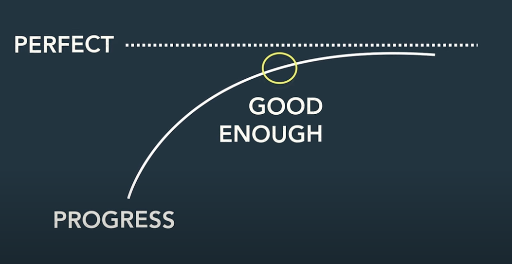
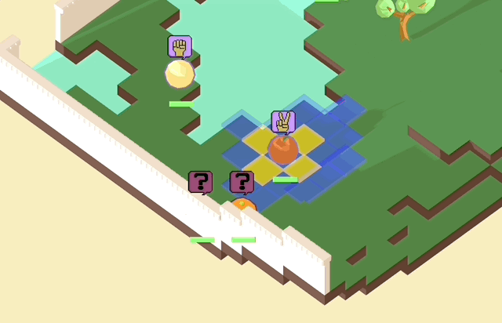

This morning I watched [a YouTube video by Phil Edwards](https://www.youtube.com/watch?v=EUmgvsGnw0w) where he reacts to reactions about his reaction to DALL-E and AI-generated art in general.  It was interesting because he described systems he uses to protect his job against AI.  Anyway, as an engineer on an ML Platform I'm probably more a part of the problem than the solution, but his video had a few nuggets of wisdom for me nonetheless.

One of the nuggets is the notion of how to "limbo the asymptote".  What this means is roughly the same as "perfect is the enemy of good".

It got me really thinking actually about my own habits in creative projects and what holds me back from finishing them being this overwhelming dissatisfaction with the "good enough" and getting tired trying to perfect every little thing about the code.  Sometimes I spent too much time refactoring and optimizing code and ultimately never finishing projects.

This weekend I went back to an old Godot project I started months (maybe a year?) ago where I make some generic framework for tactics games.  It kinda builds on [a game concept demo I made a while back called Rock Paper Scissors Fruit](https://www.youtube.com/watch?v=s8nSpHmZtfs) :

I think I liked many things about that little demo but I think its code was too rigid and focused too much on making Python work inside of Godot engine.  I have some of [the starter code for this Python-based Godot approach on Github](https://github.com/omardelarosa/godot-python-demo-game), but it's mostly abandoned now.  This time I tried to make the framework less rigid and work for both 2-D and 3-D grid levels and made a whole note codebase written 100% in GDScript.  However, after getting some grid utilities made in Godot I stopped working on it and left it there.

This weekend, though, I felt like returning to the project.  For the past few months, I've been thinking a lot about adding TCG-type mechanics to a tactics-based roguelike.  I've had a few ideas simmering in my head but hadn't really put anything down to paper, so to speak.

However, I was inspired to let go of any notions of perfectionism and accept using some placeholder pixelart graphics for now in a simple prototype that I time-boxed for 1 weekend.  I didn't quite get a finished product but I think I have enough usable code now to move forward and got the game turns and movement logic mostly working:

It's still pretty rough and I need to add working cards, but this pure GDScript project I think can go a lot further than that hybrid Python one.

For now, it's just baby steps but I am hoping to have something a lot more robust to show soon.  Hopefully this weekend of inspired continuation on this project isn't a fluke!

#productivity, #code, #gamedev, #aiart, #tactics, #project, #update

